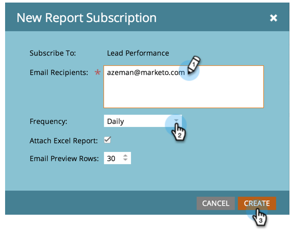

# Abonnieren eines einfachen Berichts {#subscribe-to-a-basic-report}

Um automatische Aktualisierungen eines Basisberichts zu erhalten oder diese freizugeben, können Sie eine beliebige E-Mail-Adresse für einen vorhandenen Bericht abonnieren.

>[!NOTE]
>
>Informationen zu den Abonnements für den Umsatz in Cycle Explorer finden Sie unter [Abonnieren eines Umsatz-Explorer-Berichts](/help/marketo/product-docs/reporting/revenue-cycle-analytics/revenue-explorer/subscribe-to-a-revenue-explorer-report.md).

1. Navigieren Sie zu **Marketingaktivitäten** Bereich.

   

1. Wählen Sie Ihren Bericht in der Navigationsstruktur aus und klicken Sie auf das **Abonnements** Registerkarte.

   

   >[!NOTE]
   >
   >Sie können Berichte auch über die **Analytics** Registerkarte.

1. Klicken **Neue Berichtanmeldung**.

   

1. Geben Sie die E-Mail-Adresse(n) ein und legen Sie die Häufigkeit der E-Mails in Berichten fest.

   

   >[!NOTE]
   >
   >Jeder kann sich von dem Bericht in der E-Mail abmelden, die er erhält.

   Das ist es! Überprüfen Sie Ihren Posteingang!

   

   >[!MORELIKETHIS]
   >
   >Erfahren Sie, wie Sie [alle Berichtanmeldungen verwalten](/help/marketo/product-docs/reporting/basic-reporting/report-subscriptions/manage-report-subscriptions.md) an einem Ort.
