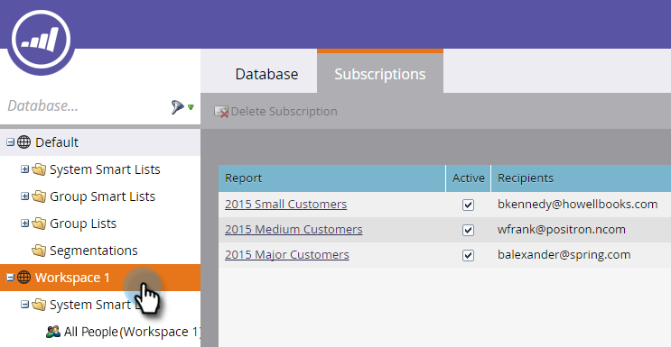

# Smart-Liste abonnieren {#subscribe-to-a-smart-list}

Das Abonnieren von Smart-Listen ist eine hervorragende Möglichkeit, Personen zu verfolgen, wobei Berichte direkt an Ihren Posteingang gesendet werden.

Sie können ein Abonnement mit der intelligenten Liste an zwei verschiedenen Stellen erstellen:

* Marketingaktivitäten
* Datenbank

Abonnements verwenden die vollständige Liste der Personen zum Zeitpunkt der Abonnementausführung.

Abonnements wohnen an der Stelle, an der sich Ihre Smart-Liste befindet, in Marketingaktivitäten oder in der Datenbank.

Sie können mehrere Abonnements aus derselben Smart-Liste erstellen.

Abonnements sind arbeitsbereichsspezifisch. Beispielsweise befindet sich diese Abonnementliste in einem anderen Arbeitsbereich als im Rest dieses Artikels:

>[!NOTE]
>
>Sie sind auf 100 Abonnements und maximal 100.000 Personen pro Abonnement in allen Arbeitsbereichen und pro Marketo-Instanz beschränkt. Wenn die Smart-Liste mehr als 100.000 Namen enthält, führt Marketo das Abonnement für die ersten 100.000 aus.

## Abonnement mit intelligenter Liste erstellen {#create-a-smart-list-subscription}

1. Rufen Sie die **Datenbank** oder die **Marketingaktivitäten** auf.

   

1. Wählen Sie die Smart-Liste aus, für die Sie ein Abonnement erstellen möchten. Klicken Sie auf **Aktionen auflisten** und wählen Sie **Neues Abonnement für intelligente Listen** aus.

   

1. Geben Sie Ihrem Abonnement einen **Namen** und wählen Sie dann die E-Mail-Adressen der **Empfänger** aus oder geben Sie sie ein.

   

1. Klicken Sie auf die Liste **Häufigkeit** und wählen Sie eine Häufigkeit aus.

   

1. Legen Sie das Datum **Versand beenden** fest. Sie können **Nie** oder ein Kalenderdatum auswählen.

   

1. Klicken Sie auf **Format** und wählen Sie aus der Liste aus.

   

1. Klicken Sie auf **Erstellen**.

   

1. Ihr neues Smart-List-Abonnement wird oben in der Liste auf der Registerkarte Abonnements angezeigt. Klicken Sie auf **Senden** , wenn Sie jetzt senden möchten, und warten Sie nicht bis zum geplanten E-Mail-Versand.

   

1. Es wird empfohlen, das Kontrollkästchen Aktiv zu deaktivieren, um ein Abonnement mit der intelligenten Liste zu deaktivieren, wenn niemand ein Abonnement mit der intelligenten Liste hat.

   

   Das war einfach, oder?

## Email Message {#email-message}

Die Empfänger erhalten eine E-Mail mit einer Option zum Herunterladen des Berichts sowie einen Link direkt zur Liste innerhalb der Marketo-Instanz. Der Download-Link läuft in vier Tagen ab.

>[!NOTE]
>
>Wenn die Einstellung [Sicherer Abonnementadministrator](/help/marketo/product-docs/reporting/basic-reporting/report-subscriptions/secure-the-subscription-admin-setting.md) auf **Ja** gesetzt ist, können nur Personen mit Zugriff auf die Marketo-Instanz den Bericht herunterladen.

Wenn ein Bericht 0 Personen enthält, erhalten die Empfänger weiterhin eine E-Mail. In der E-Mail wird jedoch lediglich darauf hingewiesen, dass es keine Personen gibt, die gemeldet werden müssen.

>[!NOTE]
>
>Wenn Sie einen Smart-List-Filter ändern, auf dem ein Abonnement basiert, wird auch der Bericht aktualisiert.

Die E-Mail enthält außerdem zusätzliche Informationen zu den Filtern, die zum Erstellen der Liste verwendet werden.

## Abonnement löschen {#delete-a-subscription}

Um ein Abonnement zu löschen, wählen Sie es im Tab Abonnements aus und klicken Sie auf Abonnement löschen .

>[!MORELIKETHIS]
>
>* [Bearbeiten eines Smart-List-Abonnements](/help/marketo/product-docs/reporting/basic-reporting/report-subscriptions/edit-a-smart-list-subscription.md)
>* [Sichern Sie die Abonnement-Administratoreinstellung](/help/marketo/product-docs/reporting/basic-reporting/report-subscriptions/secure-the-subscription-admin-setting.md)
