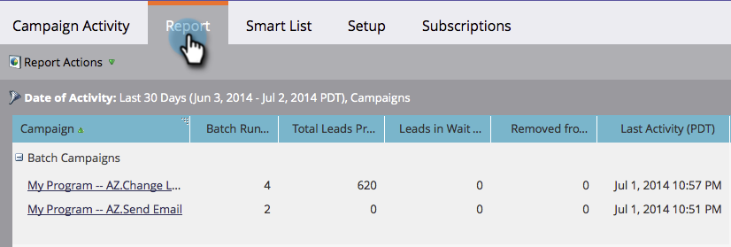

# Bericht zur Kampagnenaktivität {#campaign-activity-report}

Erfahren Sie[&#x200B; wie Ihre „Smart](/help/marketo/product-docs/core-marketo-concepts/smart-campaigns/creating-a-smart-campaign/understanding-batch-and-trigger-smart-campaigns.md){target="_blank"}Kampagnen“ funktionieren.

1. [Erstellen Sie einen Bericht](/help/marketo/product-docs/reporting/basic-reporting/creating-reports/create-a-report-in-a-program.md) und wählen Sie den **Kampagnenaktivität**&#x200B;[Berichtstyp](/help/marketo/product-docs/reporting/basic-reporting/report-types/report-type-overview.md){target="_blank"}.

1. [Legen Sie den Zeitrahmen Ihres Berichts fest](/help/marketo/product-docs/reporting/basic-reporting/editing-reports/change-a-report-time-frame.md){target="_blank"} und klicken Sie auf die Registerkarte **Bericht**.

1. Sehr gut! Durchsuchen Sie Ihren Bericht, um Ihre effektivsten Kampagnen zu identifizieren, gruppiert nach Kampagnentyp.

>[!NOTE]
>
>Alle [ausführbaren Kampagnen](/help/marketo/product-docs/core-marketo-concepts/smart-campaigns/flow-actions/execute-campaign.md){target="_blank"} werden in den Kampagnenaktivitätsberichten als „inaktive ausgelöste Kampagnen“ angezeigt.

>[!TIP]
>
>Um die Kampagnen zu finden, die die meisten Personen verarbeitet haben, z. B. [Bericht sortieren](/help/marketo/product-docs/reporting/basic-reporting/editing-reports/sort-report-on-columns.md){target="_blank"} unter _Gesamtzahl der verarbeiteten Personen_ und wählen Sie **Absteigend sortieren**.

**[Sie können für &#x200B;](/help/marketo/product-docs/reporting/basic-reporting/editing-reports/select-report-columns.md) Kampagnenaktivitätsbericht Spalten auswählen**:

<table><thead>
  <tr>
    <th>Spalte</th>
    <th>Beschreibung</th>
  </tr></thead>
<tbody>
  <tr>
    <td>Stapelausführungsanzahl</td>
    <td>Anzahl der Ausführungen der Kampagne.</td>
  </tr>
  <tr>
    <td>Gesamtanzahl Personen – Verarbeitet</td>
    <td>Anzahl der Personen, die den Fluss der Kampagne durchlaufen haben.</td>
  </tr>
  <tr>
    <td>Personen im Warteschritt</td>
    <td>Wenn eine Kampagne noch ausgeführt wird, die Anzahl der Personen, die im Warteschritt verbleiben.</td>
  </tr>
  <tr>
    <td>Aus Flow entfernt</td>
    <td>Anzahl der Personen, die aus der Kampagne entfernt wurden.</td>
  </tr>
  <tr>
    <td>Letzte Aktivität</td>
    <td>Das letzte Mal, dass eine Person von der Kampagne verarbeitet wurde.</td>
  </tr>
</tbody>
</table>

**Kampagnentypen im Bericht**:

<table><thead>
  <tr>
    <th>Typ</th>
    <th>Beschreibung</th>
  </tr></thead>
<tbody>
  <tr>
    <td>Batch</td>
    <td>Batch-Kampagnen auf der Registerkarte Marketing-Aktivitäten .</td>
  </tr>
  <tr>
    <td>Aktion ausführen</td>
    <td>Personenaktionen werden über die Datenbank ausgeführt.</td>
  </tr>
  <tr>
    <td>Ausgelöst (aktiv)</td>
    <td>Aktuell ausgelöste Kampagnen auf der Registerkarte Marketing-Aktivitäten .</td>
  </tr>
  <tr>
    <td>Ausgelöst (inaktiv)</td>
    <td>Inaktiv ausgelöste Kampagnen auf der Registerkarte Marketing-Aktivitäten .</td>
  </tr>
</tbody>
</table>

>[!MORELIKETHIS]
>
>[Kampagnenaktivitätsbericht filtern](/help/marketo/product-docs/reporting/basic-reporting/report-activity/filter-a-campaign-activity-report.md){target="_blank"}
