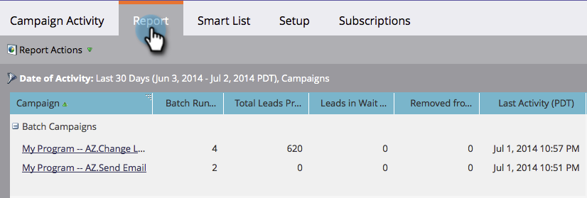

# Bericht zur Kampagnenaktivität {#campaign-activity-report}

Erfahren Sie mehr über die Leistung Ihrer [Smart-Kampagnen](/help/marketo/product-docs/core-marketo-concepts/smart-campaigns/creating-a-smart-campaign/understanding-batch-and-trigger-smart-campaigns.md){target="_blank"}.

1. [Erstellen Sie einen Bericht](/help/marketo/product-docs/reporting/basic-reporting/creating-reports/create-a-report-in-a-program.md) und wählen Sie den Berichtstyp **Kampagnenaktivität** {target="_blank"} aus.

1. [Legen Sie den Zeitrahmen für Ihren Bericht fest](/help/marketo/product-docs/reporting/basic-reporting/editing-reports/change-a-report-time-frame.md){target="_blank"} und klicken Sie auf die Registerkarte **Bericht** .

1. Sehr gut! Untersuchen Sie Ihren Bericht, um die effektivsten Kampagnen nach Kampagnentyp zu identifizieren.

>[!NOTE]
>
>Alle [ausführbaren Kampagnen](/help/marketo/product-docs/core-marketo-concepts/smart-campaigns/flow-actions/execute-campaign.md){target="_blank"} werden in Berichten zur Kampagnenaktivität als &quot;inaktiv ausgelöste Kampagnen&quot;angezeigt.

>[!TIP]
>
>Um die Kampagnen zu finden, die die meisten Personen verarbeitet haben, z. B. [sortieren Sie Ihren Bericht](/help/marketo/product-docs/reporting/basic-reporting/editing-reports/sort-report-on-columns.md){target="_blank"} nach _Gesamtzahl der verarbeiteten Personen_ und wählen Sie **Absteigende Sortierung** aus.

**[Spalten, die Sie für einen Bericht zur Kampagnenaktivität auswählen können, umfassen**:](/help/marketo/product-docs/reporting/basic-reporting/editing-reports/select-report-columns.md)

<table><thead>
  <tr>
    <th>Spalte</th>
    <th>Beschreibung</th>
  </tr></thead>
<tbody>
  <tr>
    <td>Stapelausführungsanzahl</td>
    <td>Gibt an, wie oft die Kampagne ausgeführt wurde.</td>
  </tr>
  <tr>
    <td>Gesamtanzahl Personen – Verarbeitet</td>
    <td>Anzahl der Personen, die den Fluss der Kampagne durchlaufen haben.</td>
  </tr>
  <tr>
    <td>Personen im Warteschritt</td>
    <td>Wenn eine Kampagne weiterhin ausgeführt wird, die Anzahl der Personen, die im Schritt Warten verbleiben.</td>
  </tr>
  <tr>
    <td>Aus Flow entfernt</td>
    <td>Anzahl der Personen, die aus der Kampagne entfernt wurden.</td>
  </tr>
  <tr>
    <td>Letzte Aktivität</td>
    <td>Das letzte Mal, dass eine Person von der Kampagne verarbeitet wurde.</td>
  </tr>
</tbody>
</table>

**Kampagnentypen im Bericht**:

<table><thead>
  <tr>
    <th>Typ</th>
    <th>Beschreibung</th>
  </tr></thead>
<tbody>
  <tr>
    <td>Batch</td>
    <td>Batch-Kampagnen auf der Registerkarte Marketingaktivitäten .</td>
  </tr>
  <tr>
    <td>Aktion ausführen</td>
    <td>Personenaktionen werden über die Datenbank ausgeführt.</td>
  </tr>
  <tr>
    <td>Ausgelöst (aktiv)</td>
    <td>Aktuell ausgelöste Kampagnen auf der Registerkarte Marketingaktivitäten .</td>
  </tr>
  <tr>
    <td>Ausgelöst (inaktiv)</td>
    <td>Inaktiv ausgelöste Kampagnen auf der Registerkarte Marketingaktivitäten .</td>
  </tr>
</tbody>
</table>

>[!MORELIKETHIS]
>
>[Filtern eines Berichts zur Kampagnenaktivität](/help/marketo/product-docs/reporting/basic-reporting/report-activity/filter-a-campaign-activity-report.md){target="_blank"}
