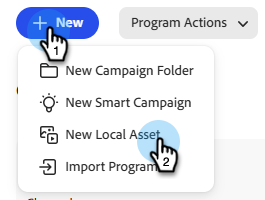

# Leistungsbericht für Kampagnen-E-Mails {#campaign-email-performance-report}

Führen Sie einen E-Mail-Leistungsbericht für Campaign aus, um Ihre E[Mail](/help/marketo/product-docs/core-marketo-concepts/smart-campaigns/creating-a-smart-campaign/understanding-batch-and-trigger-smart-campaigns.md)Leistungsstatistiken nach „Smart Campaign“ gruppiert anzuzeigen.

>[!NOTE]
>
>Ein E-Mail-Leistungsbericht für Campaign kann nur als lokales Asset in einem Marketing-Aktivitätsprogramm erstellt werden. Sie ist nicht im Abschnitt „Analytics“ verfügbar.

1. Klicken Sie in Ihrem Programm auf **Neu** und wählen Sie **Neues lokales Asset**.

   

1. Wählen Sie **Bericht** aus.

   

1. Wählen Sie in _Dropdown_ Typ“ die Option **Kampagnen-E-Mail-Leistung**. Geben Sie Ihrem Bericht einen Namen und klicken Sie auf **Erstellen**.

   

1. Definieren Sie die Parameter Ihres Berichts.

   

1. Wenn Sie fertig sind, klicken Sie auf die **Bericht**, um Ihren Bericht anzuzeigen.

[Sie können für ](/help/marketo/product-docs/reporting/basic-reporting/editing-reports/select-report-columns.md) Campaign-E-Mail-Leistungsbericht Spalten auswählen:

| Spalte | Beschreibung |
|---|---|
| [!UICONTROL Hardbounce] | E-Mail wurde aufgrund einer permanenten Bedingung abgelehnt, z. B. einer nicht vorhandenen E-Mail-Adresse. |
| [!UICONTROL Softbounce] | E-Mail wurde aufgrund einer temporären Bedingung abgelehnt, z. B. weil ein Server ausgefallen oder der Posteingang voll ist. |
| [!UICONTROL Ausstehend] | E-Mail wird noch zugestellt. |
| [!UICONTROL Link angeklickt] | Anzahl der E-Mail-Empfangenden, die auf einen Link in der E-Mail geklickt haben. |
| [!UICONTROL Abo storniert] | Die Anzahl der E-Mail-Empfänger, die auf den **[!UICONTROL Abmelden]**-Link in der E-Mail geklickt und das Formular ausgefüllt haben. |

>[!NOTE]
>
>Im Allgemeinen wird versucht, beim Erfassen dieser Statistiken gesunden Menschenverstand einzusetzen. Wenn beispielsweise jemand auf einen Link in einer E-Mail geklickt hat, hat er ihn offensichtlich zuerst geöffnet. Die spezifischen Regeln, die wir befolgen, finden Sie im [E-Mail-Leistungsbericht](/help/marketo/product-docs/email-marketing/email-programs/email-program-data/email-performance-report.md).

>[!MORELIKETHIS]
>
>* [Filtern von Assets in einem Campaign-E-Mail-Bericht](/help/marketo/product-docs/reporting/basic-reporting/report-activity/filter-assets-in-a-campaign-email-reports.md)
>* [E-Mail-Leistungsbericht](/help/marketo/product-docs/email-marketing/email-programs/email-program-data/email-performance-report.md)
