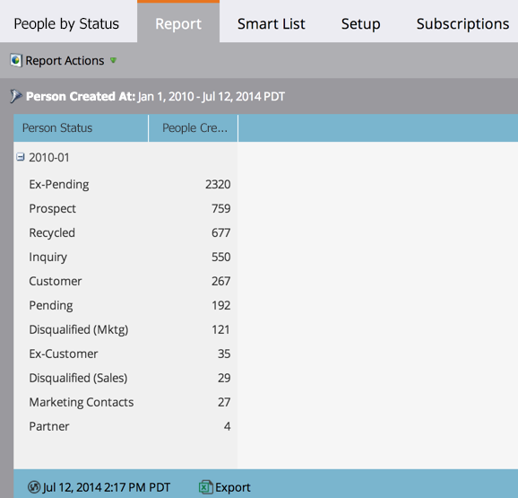

# Bericht zu Personen nach Status {#people-by-status-report}

Überprüfen Sie, wie gut Sie Personen durch den Prozess führen, indem Sie jeden Monat überprüfen, wie viele von ihnen in jedem _Personenstatus_-Wert angezeigt werden.

1. [Erstellen Sie einen Bericht](/help/marketo/product-docs/reporting/basic-reporting/creating-reports/create-a-report-in-a-program.md) und wählen Sie den **Personen nach Status** [Berichtstyp](/help/marketo/product-docs/reporting/basic-reporting/report-types/report-type-overview.md).

1. [Legen Sie den Zeitrahmen Ihres Berichts fest](/help/marketo/product-docs/reporting/basic-reporting/editing-reports/change-a-report-time-frame.md) und klicken Sie auf die Registerkarte **Bericht**.

1. Sehr gut! Jetzt können Sie sehen, wie viele Personen sich von Monat zu Monat in jedem Personenstatus befanden.

   

   >[!TIP]
   >
   >Klicken Sie auf das Pluszeichen (+), um jeden Monat zu erweitern und die spezifischen Zahlen für jeden Personenstatus anzuzeigen.

   >[!MORELIKETHIS]
   >
   >[Verwenden Sie eine Smart-Liste, um Ihren Bericht nach ](/help/marketo/product-docs/reporting/basic-reporting/editing-reports/filter-people-in-a-report-with-a-smart-list.md) Personen zu filtern.
