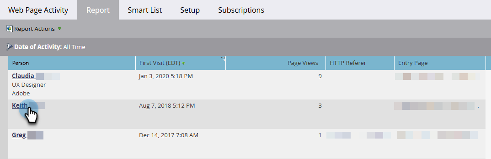

# Bericht zu angezeigten Web-Seiten und Web-Seiten-Aktivitäten {#web-pages-viewed-web-page-activity-report}

In einem [[!UICONTROL Web-]-Bericht](/help/marketo/product-docs/reporting/basic-reporting/report-types/web-page-activity-report.md) können Sie die spezifischen Seiten sehen, die von den Personen im Bericht angesehen wurden.

>[!PREREQUISITES]
>
>Um Aktivitäten von Ihrer Website in Marketo zu erfassen, müssen Sie zunächst [auf  [!DNL Munchkin]  Website einrichten](/help/marketo/product-docs/administration/additional-integrations/add-munchkin-tracking-code-to-your-website.md).

1. Klicken Sie [ Bericht „Webseitenaktivität](/help/marketo/product-docs/reporting/basic-reporting/report-types/web-page-activity-report.md) auf den Namen der Person.

   

1. Eine neue Registerkarte wird geöffnet, auf der die Liste der Seiten auf Ihrer Site, die die Person besucht hat, und der Zeitpunkt angezeigt werden.

   

   >[!MORELIKETHIS]
   >
   >Erstellen Sie einen [Bericht zur Web-Aktivität des Unternehmens](/help/marketo/product-docs/reporting/basic-reporting/report-types/company-web-activity-report.md), um zu sehen, welche Unternehmen Ihre Site besuchen.
