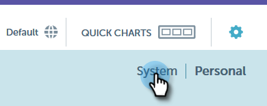
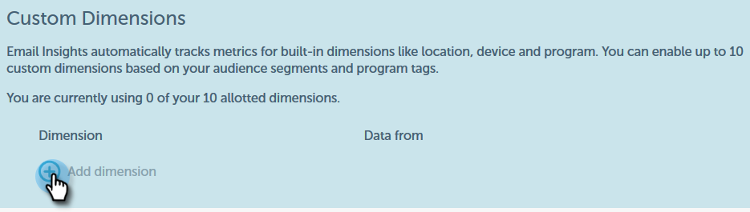

# Benutzerdefinierte Dimensionen für E-Mail Insights {#custom-dimensions-for-email-insights}

Alle standardmäßigen Marketo-Dimensionen sind enthalten, Sie haben jedoch die Möglichkeit, bis zu 10 benutzerdefinierte Dimensionen hinzuzufügen. Benutzerdefinierte Dimensionen bestehen aus Segmentierungen und Programm-Tags. So fügen Sie sie hinzu:

>[!NOTE]
>
>**Administratorberechtigungen erforderlich**

>[!CAUTION]
>
>Benutzerdefinierte Dimensionen **können** nicht gelöscht oder ersetzt werden. Wählen Sie daher Ihre 10 sorgfältig aus.

1. Klicken [!UICONTROL &#x200B; in „E]Mail-Einblicke“ oben rechts auf der Seite auf das Zahnradsymbol.

   

1. Klicken Sie auf **[!UICONTROL System]**.

   

1. Klicken Sie auf das **+** neben **[!UICONTROL Dimension hinzufügen]**.

   

1. Beginnen Sie auszuwählen!

   

   >[!NOTE]
   >
   >**[!UICONTROL Nach Zielgruppe]**: Zeigt alle genehmigten Segmentierungen an (aus der Datenbank)
   >
   >**[!UICONTROL Nach Inhalt]**: Zeigt alle Programm-Tags an
