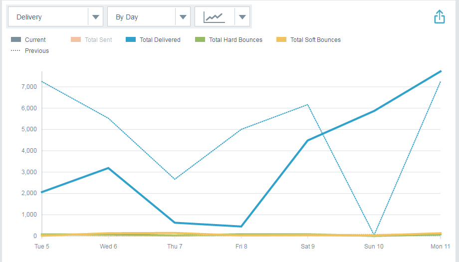

# Email Insights Analytics-Übersicht {#email-insights-analytics-overview}

Untersuchen Sie in Analytics die aggregierten Daten für E-Mail-Versand und Interaktion. Verwenden Sie das Diagramm auf der linken Seite, um Daten zu erkunden, die Einblicke auf der rechten Seite für ein besser geführtes Erlebnis.

[Filterung](/help/marketo/product-docs/reporting/email-insights/filtering-in-email-insights.md) ist verfügbar, um Sie bei der Aufschlüsselung nach bestimmten Metriken zu unterstützen.

Kacheln zu wichtigen Punkten (Key Points of Interest, KPI) bieten einen schnellen Überblick über die beliebtesten Metriken.

Bewegen Sie den Mauszeiger über die KPI-Kacheln, um Details anzuzeigen…

…oder Details anzeigen, ohne den Mauszeiger darüber bewegen zu müssen, indem Sie Ihr Browser-Fenster erweitern (auf größeren Bildschirmen).

>[!TIP]
>
>Diese Farben bedeuten etwas! Grün bedeutet eine gute Änderung, Rot bedeutet eine schlechte Änderung, Grau bedeutet, dass sich nichts geändert hat. Dies basiert auf dem Vergleichszeitraum, den Sie beim Filtern ausgewählt haben.

Das Diagramm zeigt Ihre gefilterten Kriterien an. Um einen Ihrer Filter auszublenden, klicken Sie einfach auf die Farbleiste…

…und die Metrik verschwindet aus dem Diagramm. Klicken Sie erneut auf die Farbleiste, damit sie wieder angezeigt wird.

Wenn Sie ein Diagramm erstellen, das Sie erneut verwenden möchten, erstellen Sie ein [Schnelldiagramm](/help/marketo/product-docs/reporting/email-insights/email-insights-quick-charts.md).

Rechts auf der Seite finden Sie anhand geführter Metriken relevante Treiber. Klicken Sie auf eine beliebige Metrik, um sie im Diagramm links auf der Seite anzuzeigen.

>[!NOTE]
>
>Siehst du oben rechts die Aktualisierung? Wenn Sie sie sehen, müssen Sie manuell darauf klicken, um das Insights-Modul zu aktualisieren. Sie wird nur angezeigt, wenn Sie Änderungen an Filtern vorgenommen haben, durch die die aktuellen Werte ungültig würden.

Sie können auch angeben, was angezeigt wird (von links nach rechts): Alle, Zielgruppe, Inhalte und Plattform.

>[!MORELIKETHIS]
>
>[Email Insights - Sendeübersicht](/help/marketo/product-docs/reporting/email-insights/email-insights-sends-overview.md)
