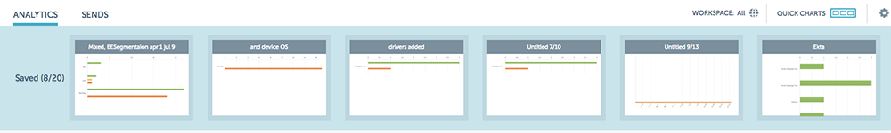

# Quick Charts für E-Mail-Insights {#email-insights-quick-charts}

Schnelldiagramme sind Miniaturansichten, die Sie anpassen und speichern, um eine schnelle Ansicht der Diagramme zu ermöglichen, die Sie am häufigsten verwenden.

## Neues Schnelldiagramm erstellen {#create-a-new-quick-chart}

In diesem Beispiel wählen wir die Öffnungsrate für die ersten drei Wochen im Februar 2016 in den Bundesstaaten Kalifornien und Florida.

1. Klicken Sie auf den Datumsfilter rechts neben dem Bildschirm &quot;Analytics&quot;.

   

1. Wählen Sie den gewünschten Datumsbereich aus.

   

1. Wenn Sie Ihren Datumsbereich ausgewählt haben, klicken Sie auf **Anwenden**.

   

1. Das Diagramm ändert sich, nachdem Ihre Daten angewendet wurden.

   

1. Klicken Sie auf die erste Dropdown-Liste. Klicken Sie auf , um Ihr Kriterium auszuwählen (falls noch nicht ausgewählt) und die Auswahl der nicht gewünschten Kriterien aufzuheben.

   

1. Klicken Sie rechts im Diagramm auf das Exportsymbol und wählen Sie **Als Schnelldiagramm speichern** aus.

   

1. Benennen Sie das Schnelldiagramm und klicken Sie auf **Speichern**.

   

   >[!NOTE]
   >
   >Sie können bis zu 20 Schnelldiagramme haben. Sie können gelöscht und ersetzt werden.

1. Ihr neues Schnelldiagramm wird zusammen mit den anderen angezeigt.

   

   Und das ist es!

   >[!TIP]
   >
   >Um ein beliebiges Schnelldiagramm zu verschieben, klicken Sie einfach auf und ziehen Sie es an die gewünschte Position.

## Schnelldiagramm löschen {#delete-a-quick-chart}

Möchten Sie eine Ihrer Schnelldiagramme löschen? Es ist einfach!

1. Klicken Sie auf das Symbol **Schnelldiagramme**.

   

1. Bewegen Sie den Mauszeiger über das gewünschte Diagramm, klicken Sie jedoch nicht darauf. Beim Bewegen des Mauszeigers wird ein X angezeigt. Klicken Sie auf den **X**.

   

1. Klicken Sie auf **OK**.

   

   Ihr Schnelldiagramm wurde jetzt gelöscht. Sag dir, es war einfach.
