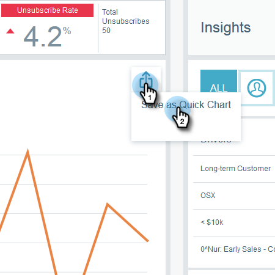
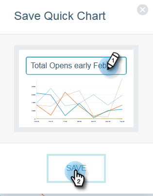

# E-Mail-Einblicke - Schnelldiagramme {#email-insights-quick-charts}

Quick Charts sind Miniaturansichten, die Sie anpassen und speichern, und bieten eine schnelle Ansicht von Diagrammen, die Sie am häufigsten verwenden.

## Erstellen eines neuen Kurzdiagramms {#create-a-new-quick-chart}

In diesem Beispiel wählen wir den offenen Tarif für die ersten drei Wochen des Februar 2016 in den Bundesstaaten Kalifornien und Florida.

1. Klicken Sie auf den Datumsfilter auf der rechten Seite des Anzeigebereichs &quot;Analytics&quot;.

   

1. Wählen Sie den gewünschten Datumsbereich aus.

   

1. Wenn Sie Ihren Datumsbereich ausgewählt haben, klicken Sie auf **Übernehmen**.

   

1. Das Diagramm ändert sich, nachdem Ihre Daten angewendet wurden.

   

1. Klicken Sie auf die erste Dropdownliste. Klicken Sie auf , um Ihr Kriterium auszuwählen (falls es nicht bereits ausgewählt ist) und deaktivieren Sie alle unerwünschten Kriterien.

   

1. Klicken Sie auf der rechten Seite des Diagramms auf das Exportsymbol und wählen Sie **Als Quick Chart** speichern.

   

1. Benennen Sie Ihr QuickChart und klicken Sie auf **Speichern**.

   

   >[!NOTE]
   >
   >Sie können bis zu 20 Quick Charts haben. Sie können gelöscht und ersetzt werden.

1. Ihr neues QuickChart wird zusammen mit den anderen angezeigt.

   

   Und das ist es!

   >[!TIP]
   >
   >Zum Verschieben eines Schnelldiagramms klicken Sie einfach auf das Diagramm und ziehen es an die gewünschte Position.

## Schnelldiagramm löschen {#delete-a-quick-chart}

Möchten Sie eine Ihrer Quick Charts löschen? Es ist einfach!

1. Klicken Sie auf das Symbol **Schnelldiagramme** .

   

1. Bewegen Sie den Mauszeiger über das gewünschte Diagramm, aber klicken Sie nicht darauf. Beim Bewegen des Mauszeigers wird ein X angezeigt. Klicken Sie auf das **X**.

   

1. Klicken Sie auf **OK**.

   

   Ihr QuickChart wird jetzt gelöscht. Sagte dir, es sei einfach.

