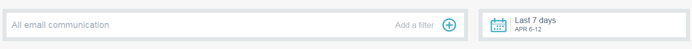

# Sendungen mit E-Mail Insights – Überblick {#email-insights-sends-overview}

Untersuchen Sie auf [!UICONTROL &#x200B; Seite &#x200B;]Sendungen“ die Eigenschaften der letzten E-Mail-Kommunikation.

Verwenden Sie [Filtern](/help/marketo/product-docs/reporting/email-insights/filtering-in-email-insights.md) um anzugeben, welche E-Mails angezeigt werden sollen.

Rechts auf der Seite finden Sie mehrere Informationen zu Ihren gesendeten E-Mails.

**[!UICONTROL Typ]** gibt die Art des verwendeten Assets an.
**[!UICONTROL Empfängernummer]** ist die Anzahl der Personen, denen die E-Mail gesendet wurde.
**[!UICONTROL Versandmetriken]** bietet einen schnellen Überblick darüber, wie viele E-Mails zugestellt wurden, ausstehen oder zurückgeschickt wurden.
**[!UICONTROL Interaktionsmetriken]** bietet einen schnellen Überblick darüber, wie viele Empfänger eine E-Mail geöffnet, angeklickt und ihr Abonnement beendet haben.
**[!UICONTROL Score]** ist der [Interaktionswert](/help/marketo/product-docs/email-marketing/drip-nurturing/reports-and-notifications/understanding-the-engagement-score.md) Ihrer E-Mail.

Standardmäßig werden Ihre E-Mails nach den neuesten sortiert, Sie können sie jedoch nach jeder verfügbaren Metrik sortieren.

>[!NOTE]
>
>E-Mails werden nach Programm- oder Kampagnenname (oben) und E-Mail-Asset-Name (unten) aufgelistet.

Wenn Sie den Status Ihrer E-Mail in Analytics anzeigen möchten, bewegen Sie den Mauszeiger neben Bewertung und klicken Sie auf das Diagrammsymbol.

Cooles Zeug!

>[!MORELIKETHIS]
>
>[Email Insights Analytics-Übersicht](/help/marketo/product-docs/reporting/email-insights/email-insights-analytics-overview.md)
