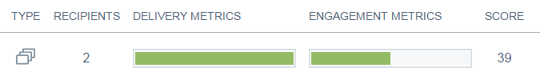

# Email Insights Sends Overview {#email-insights-sends-overview}

Überprüfen Sie auf der Seite &quot;Senden&quot;die Eigenschaften der letzten E-Mail-Kommunikation.

Verwenden Sie [filter](/help/marketo/product-docs/reporting/email-insights/filtering-in-email-insights.md), um anzugeben, welche E-Mails Sie sehen möchten.

Auf der rechten Seite der Seite befinden sich verschiedene Informationen zu Ihren gesendeten E-Mails.

**** Typeindiktiert die Art des verwendeten Assets.
**Die** Empfängernummer ist die Anzahl der Personen, die die E-Mail erhalten haben.
**Versand** Metricsbietet Ihnen eine schnelle Ansicht, wie viele E-Mails zugestellt, ausstehend oder abgesprungen wurden.\
**Interaktionsmetriken** geben Ihnen eine schnelle Ansicht, wie viele Empfänger eine E-Mail geöffnet, angeklickt und abbestellt haben.
**Zeigt** die  [Interaktionsbewertung](/help/marketo/product-docs/email-marketing/drip-nurturing/reports-and-notifications/understanding-the-engagement-score.md) Ihrer E-Mail an.

Standardmäßig werden Ihre E-Mails nach der neuesten sortiert, Sie können sie jedoch nach jeder verfügbaren Metrik sortieren.

>[!NOTE]
>
>E-Mails werden nach Programm- oder Kampagnen-Namen (oben) und E-Mail-Asset-Namen (unten) aufgelistet.

Wenn Sie die Statistik Ihrer E-Mail in Analytics Ansicht haben möchten, halten Sie den Mauszeiger neben &quot;Ergebnis&quot;und klicken Sie auf das Diagrammsymbol.

Coole Sachen!

>[!MORELIKETHIS]
>
>[Übersicht über die Analyse von E-Mail Insights](/help/marketo/product-docs/reporting/email-insights/email-insights-analytics-overview.md)
