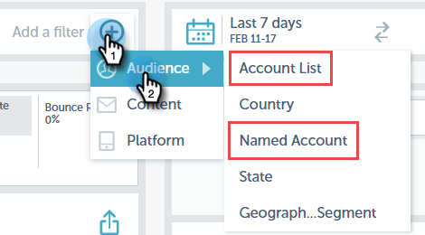

# Filtern in [!UICONTROL E-Mail-Einblicke] {#filtering-in-email-insights}

In [!UICONTROL Email Insights] gibt es verschiedene Möglichkeiten, Ihre Daten zu filtern.

## [!UICONTROL E-Mail-Insights] {#email-insights}

Klicken Sie auf das Pluszeichen (+), um Filter hinzuzufügen. Fügen Sie so viele hinzu, wie Sie möchten.

Wenn Sie mehr als einen Filter in derselben Kategorie haben, werden diese zusammengeführt und der Betrag wird angezeigt.

Wenn Sie jemals sehen müssen, welche Filter Sie angewendet haben, klicken Sie einfach auf den Filter. Sie können dort sogar noch mehr hinzufügen.

Sie können auch zusätzliche Filtertypen hinzufügen.

Und noch mehr Filter!

Das Diagramm ändert sich, nachdem jeder Filter angewendet wurde.

Um eine Kategorie zu löschen, klicken Sie auf ihr X.

Um alle Filter zu löschen, klicken Sie auf das X am Ende der Filterleiste.

Verwenden Sie für datumsspezifische Daten Datumsbereiche.

Wählen Sie aus den gängigen voreingestellten Datumsbereichen, wählen Sie bestimmte Datumswerte aus und verwenden Sie sogar den vorherigen Zeitraum für den Vergleich.

>[!NOTE]
>
>Datumsbereiche gelten sowohl für die Seite [!UICONTROL Analytics] als auch für [!UICONTROL Sendungen]. Die **Vergleichen**-Option gilt jedoch nur für die [!UICONTROL Analytics]-Seite.

## Account-Based-Marketing {#account-based-marketing}

Wenn Sie [[!UICONTROL Target-Kontoverwaltung]](https://docs.marketo.com/display/DOCS/Account+Based+Marketing+Overview) verwenden, gibt es Filter speziell für Sie.

