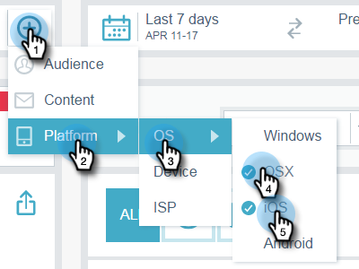

# Filtern in E-Mail-Insights {#filtering-in-email-insights}

In Email Insights gibt es verschiedene Möglichkeiten, Ihre Daten zu filtern.

## E-Mail Insights {#email-insights}

Klicken Sie auf + , um Filter hinzuzufügen. Fügen Sie so viele hinzu, wie Sie möchten.

Wenn mehrere Filter in derselben Kategorie vorhanden sind, werden diese zusammengeführt und der Betrag angezeigt.

Wenn Sie jemals sehen möchten, welche Filter Sie angewendet haben, klicken Sie einfach auf den Filter. Dort können Sie sogar noch mehr hinzufügen.

Sie können auch zusätzliche Filtertypen hinzufügen.

Und noch mehr Filter!

Das Diagramm ändert sich, nachdem jeder Filter angewendet wurde.

Um eine Kategorie zu löschen, klicken Sie auf ihr X.

Um alle Filter zu löschen, klicken Sie auf das X am Ende der Filterleiste.

Verwenden Sie für datumsspezifische Daten Datumsbereiche.

Wählen Sie aus allgemeinen vordefinierten Datumsbereichen aus, wählen Sie bestimmte Daten aus und verwenden Sie sogar den vorherigen Zeitraum zum Vergleich.

>[!NOTE]
>
>Datumsbereiche gelten sowohl für die Analytics-Seite als auch für die Seite Sendungen . Die Option **Vergleichen** gilt jedoch nur für die Analytics-Seite.

## Account-Based-Marketing {#account-based-marketing}

Wenn Sie [Target Account Management](https://docs.marketo.com/display/DOCS/Account+Based+Marketing+Overview) verwenden, gibt es speziell Filter für Sie.

