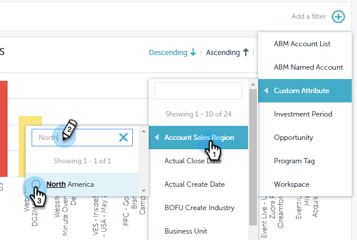

# Filtern in Leistungseinsichten {#filtering-in-performance-insights}

Filtern Sie Daten einfach nach Abfrage spezifischer Informationen.

Klicken Sie auf das Pluszeichen, um dem Beginn Filter hinzuzufügen.

>[!NOTE]
>
>Derzeit sind benutzerdefinierte Attribute in Filtern nur für Kunden verfügbar, die [RCA](http://docs.marketo.com/x/lwIk) aktiviert haben.

Wenn Sie auf eine Kategorie klicken, werden mehrere Kategorien angezeigt.

Wählen Sie eine Kategorie aus und suchen/wählen Sie einen Wert.

Die Diagramme werden entsprechend der ausgewählten Filter aktualisiert.

Sie können weitere Filter hinzufügen, indem Sie die gleichen Schritte ausführen.

Sie können einen Filter jederzeit entfernen, indem Sie auf das X neben dem Filter klicken. Entfernen Sie alle Filter gleichzeitig, indem Sie auf das X ganz rechts klicken.

## Verfügbare Filter {#available-filters}

<table> 
 <tbody> 
  <tr> 
   <td colspan="1"><strong>ABM-Konto-Liste</strong></td> 
   <td colspan="1">Wenn Sie Marketo ABM verwenden, werden alle Ihre Listen mit MPI synchronisiert und über den Filter "ABM Account Liste"angezeigt. Sie können eine Liste auswählen, um die Ergebnisse auf diese Konten zu filtern.<a href="https://docs.marketo.com/display/public/DOCS/Account-Based+Web+Marketing+with+ABM" rel="nofollow">Erfahren Sie mehr über die Listen des ABM-Kontos.</a></td> 
  </tr> 
  <tr> 
   <td colspan="1"><strong>ABM-benanntes Konto</strong></td> 
   <td colspan="1">Wenn Sie Marketo ABM verwenden, werden alle Ihre benannten Konten mit MPI synchronisiert und über den Filter "ABM-benanntes Konto"sichtbar. Sie können ein benanntes Konto auswählen, um die Ergebnisse auf diese Konten zu filtern.<a href="http://docs.marketo.com/x/eaCt" rel="nofollow">Erfahren Sie mehr über die von ABM benannten Konten.</a></td> 
  </tr> 
  <tr> 
   <td colspan="1"><strong>Benutzerdefinierte Attribute</strong></td> 
   <td colspan="1">
Diese werden von Ihnen bestimmt. Alle Felder, die <a href="http://docs.marketo.com/display/public/DOCS/Enabling+Custom+Field+Sync+for+Revenue+Cycle+Analytics" rel="nofollow">Sie für die Analyse der Möglichkeiten aktivieren</a> , können in Performance Insights gefiltert werden.
</td> 
  </tr> 
  <tr> 
   <td colspan="1">
<strong>Investitionszeitraum</strong>
</td> 
   <td colspan="1">
Programm kostet Zeitrahmen.
</td> 
  </tr> 
  <tr> 
   <td colspan="1">
<strong>Opportunity-Typ</strong>
</td> 
   <td colspan="1">
Opportunity-Typ, wie im Opportunity-Objekt in Ihrer Salesforce (CRM)-Einrichtung eingerichtet.
</td> 
  </tr> 
  <tr> 
   <td>
<strong>Programm-Tag</strong>
</td> 
   <td>
Tags werden zur Beschreibung von Programmen verwendet. Sie können so viele machen, wie Sie benötigen, mit jeweils eindeutigen Werten. <a href="https://docs.marketo.com/display/public/DOCS/Tags" rel="nofollow">Hier erfahren Sie, wie Sie mit Programm-Tags arbeiten.</a>
</td> 
  </tr> 
  <tr> 
   <td><strong>Arbeitsbereich</strong></td> 
   <td>
Arbeitsflächen sind separate Bereiche in Marketo, die Marketing-Assets enthalten, z. B.: programms, Landingpages, E-Mails und mehr. <a href="https://docs.marketo.com/display/public/DOCS/Understanding+Workspaces+and+Person+Partitions" rel="nofollow">Hier erfahren Sie mehr über Arbeitsbereiche.</a>
</td> 
  </tr> 
 </tbody> 
</table>

>[!NOTE]
>
>Im Dashboard Interaktion sind nur Programm-Tags und Workspace-Filter verfügbar.

