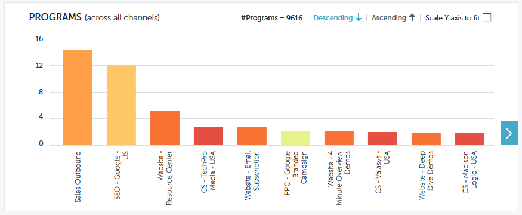

# Leistungseinblicke - Beitragsübersicht {#performance-insights-contribution-overview}

In Marketo Performance Insights wird die Beitragsansicht standardmäßig angezeigt.

Wählen Sie die Metrik aus, nach der Sie die Leistung anzeigen möchten. In diesem Beispiel werden wir uns die Chancen ansehen, die durch Multi-Touch im Umsatz-Dashboard gewonnen wurden.

>[!NOTE]
>
>Informationen zu [Erstkontakt und Multi-Touch](/help/marketo/product-docs/reporting/revenue-cycle-analytics/revenue-tools/attribution/understanding-attribution.md).

Wählen Sie aus, für welchen Zeitraum Metriken angezeigt werden sollen. In diesem Beispiel betrachten wir das aktuelle Jahr (Jahr bis heute).

>[!NOTE]
>
>Die Auswahl &quot;Vorheriges Jahr&quot;wurde vorübergehend entfernt. Sie haben weiterhin die Möglichkeit, die Leistungsdaten des gesamten Vorjahres über die Auswahl des benutzerdefinierten Bereichs anzuzeigen.

Die Metriken werden in zwei Diagrammen dargestellt: Doppel- und Balkendiagramm.

Das Doppeldiagramm zeigt die Top-10-Kanäle für die ausgewählte Metrik an.

Das Balkendiagramm zeigt die Programmleistung über alle Kanäle (zehn Programme gleichzeitig) für die ausgewählte Metrik an. Um weitere Informationen anzuzeigen, klicken Sie auf den Pfeil rechts, um zur nächsten Gruppe zu scrollen.

>[!TIP]
>
>Wenn die Balken im Diagramm beim Scrollen durch die Gruppen vergrößert werden sollen, wählen Sie die **Anpassbare Y-Achse skalieren** aktivieren.

Bewegen Sie den Mauszeiger über eine Leiste, um weitere Details anzuzeigen.

Wählen Sie einen oder mehrere Kanäle in der Doppelt-Grafik aus, und alle mit diesen Kanälen verknüpften Programme werden in der Balkendiagramm auf der rechten Seite angezeigt. Klicken Sie erneut auf die Kanäle, um die Auswahl aufzuheben.

Das unten stehende Datenraster funktioniert wie eine Tabelle und zeigt alle verfügbaren Metriken unter dem ausgewählten Attributionsmodell (Erstkontakt/Multi-Touch) an. Die Spalte mit der ausgewählten Metrik wird hervorgehoben.

| **Gewonnene Chancen** | Der Teil der Gutschrift (in numerischem Wert), den das Programm zur Beeinflussung der gewann Gelegenheit erhalten hat |
|---|---|
| **Gewonnener Ertrag** | Der Teil des Kredits (in Geldwert), den das Programm zur Beeinflussung der gewann Chance erhalten hat |
| **Kosten** | Gesamtkosten des Programms |
| **Kosten je gewonnener Chance** | Verhältnis der Programmkosten und des (numerischen) Kreditbetrags, den das Programm erhalten hat, um die Schaffung neuer Möglichkeiten zu beeinflussen |
| **Umsatz in % Kostenverhältnis** | Verhältnis des Kreditanteils (in Geldwert) des Programms zur Beeinflussung der eigenen Chancen und der Kosten des Programms |

Erweitern Sie einen Kanal, um die zehn wichtigsten Programme zu sehen, wobei die restlichen Programme kombiniert werden.

>[!NOTE]
>
>Wenn Sie auf das Kontrollkästchen neben einem Kanal klicken, wird dieser im Diagramm oben aktiviert/deaktiviert.
