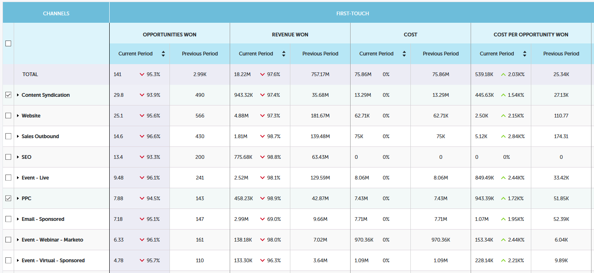

# [!UICONTROL Performance Insights] Beitragsübersicht {#performance-insights-contribution-overview}

In Marketo [!UICONTROL Performance Insights] wird standardmäßig die Beitragsansicht angezeigt.

Wählen Sie die Metrik aus, nach der Sie die Leistung anzeigen möchten. In diesem Beispiel werden die über „Multi-Touch **[!UICONTROL im Dashboard]** Umsatz _[!UICONTROL gewonnenen]_ behandelt.

>[!NOTE]
>
>Erfahren Sie mehr über [[!UICONTROL Erstkontakt] und [!UICONTROL Mehrfachkontakt]](/help/marketo/product-docs/reporting/revenue-cycle-analytics/revenue-tools/attribution/understanding-attribution.md).

Wählen Sie aus, für welchen Zeitraum Sie Metriken anzeigen möchten. In diesem Beispiel sehen wir das aktuelle Jahr (vom aktuellen Datum bis zum aktuellen Datum).

>[!NOTE]
>
>Wir haben die Auswahl „Vorjahr“ vorübergehend entfernt. Sie haben weiterhin die Möglichkeit, die gesamten Leistungsdaten des Vorjahres mithilfe der Auswahl **[!UICONTROL Benutzerdefinierter Bereich“]**.

Die Metriken werden in zwei Diagrammen angezeigt: Ringdiagramm und Balkendiagramm.

Das Ringdiagramm zeigt die zehn wichtigsten Kanäle für die ausgewählte Metrik.

Das Balkendiagramm zeigt die Programmleistung für alle Kanäle (zehn Programme gleichzeitig) für die ausgewählte Metrik an. Um weitere Informationen anzuzeigen, klicken Sie auf den Pfeil rechts, um zur nächsten Gruppe zu scrollen.

>[!TIP]
>
>Wenn Sie möchten, dass die Balken im Diagramm beim Scrollen durch die Gruppen nach oben skaliert werden, aktivieren Sie das Kontrollkästchen **[!UICONTROL Y-Achse anpassen]**.

Bewegen Sie den Mauszeiger über eine Leiste, um weitere Details anzuzeigen.

Wählen Sie einen oder mehrere Kanäle im Ringdiagramm aus, und alle mit diesen Kanälen verknüpften Programme werden im Balkendiagramm rechts angezeigt. Klicken Sie erneut auf den/die Kanal/Kanäle, um die Auswahl aufzuheben.

Das nachstehende Datenraster funktioniert wie eine Tabelle und zeigt alle verfügbaren Metriken unter dem ausgewählten Attributionsmodell ([!UICONTROL Erstkontakt]/[!UICONTROL Mehrfachkontakt]). Die Spalte mit der ausgewählten Metrik ist hervorgehoben.

| **[!UICONTROL Opportunities gewonnen]** | Der Anteil des Guthabens (in numerischem Wert), den das Programm zur Beeinflussung der gewonnenen Opportunity erhalten hat |
|---|---|
| **[!UICONTROL Umsatz gewonnen]** | Der Teil des Kredits (in monetärer Höhe), den das Programm zur Beeinflussung der gewonnenen Opportunity erhalten hat |
| **[!UICONTROL Kosten]** | Gesamtkosten des Programms |
| **[!UICONTROL Kosten pro gewonnener Opportunity]** | Das Verhältnis zwischen den Programmkosten und dem Anteil des Kredits (in numerischem Wert), den das Programm erhalten hat, um die Schaffung neuer Möglichkeiten zu beeinflussen |
| **[!UICONTROL Umsatz gewonnen zu Kostenverhältnis]** | Das Verhältnis des Kreditanteils (in monetärer Höhe), den das Programm zur Beeinflussung der gewonnenen Chancen erhalten hat, und die Kosten des Programms |

Erweitern Sie einen Kanal, um die zehn wichtigsten Programme anzuzeigen, wobei die verbleibenden Programme kombiniert werden.

>[!NOTE]
>
>Wenn Sie auf das Kontrollkästchen neben einem Kanal klicken, wird dieser im Ringdiagramm oben aktiviert/deaktiviert.
