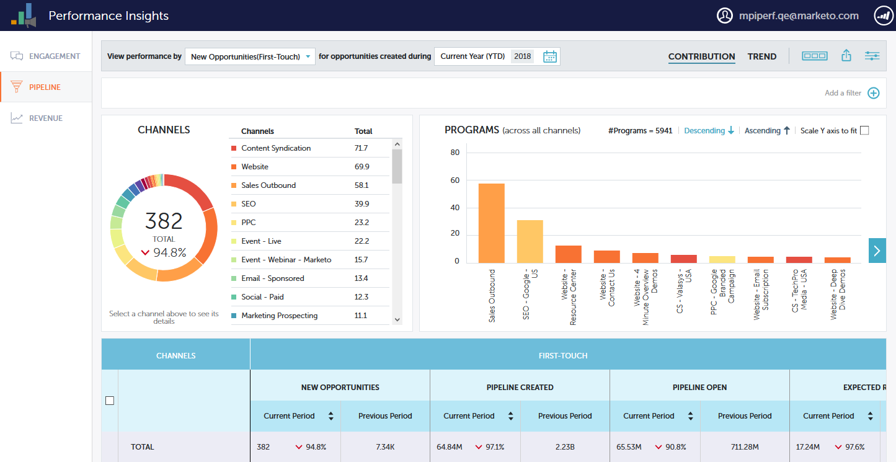

# [!UICONTROL Performance Insights] Dashboards {#performance-insights-dashboards}

Erfahren Sie mehr über die verfügbaren Dashboards in MPI.

## [!UICONTROL Interaktion] {#engagement}

Mit [!UICONTROL  Dashboard ]Interaktion“ können Sie die Effektivität Ihrer Programme zur Namenserwerbung und zur Namenserwerbung messen.

Messen der Interaktion mit Zielgruppen

Wählen Sie die Metrik **[!UICONTROL Erfolg]**, um die Interaktion der Zielgruppe mit Ihren Nurture-Programmen zu messen. Erfolg ist ein Maßstab für sinnvolle Interaktion in Marketo.

Zweck eines Programms ist es, eine sinnvolle Interaktion mit der Person oder dem potenziellen Kunden herzustellen. Erfolg wird markiert, wenn eine Person den Status erreicht, der dieses Ziel erreicht. Er kann an einem Webinar teilnehmen, auf einen Link in einer E-Mail klicken oder ein Web-Formular ausfüllen. Der Erfolg hängt vom Programmkanal ab.

>[!NOTE]
>
>Ein Webinar-Programm kann mehrere Status aufweisen, z. B. „Eingeladen“, „Registriert“ und „Teilgenommen“. Eingeladene oder registrierte Personen sind keine sinnvollen Interaktionen, da die Teilnehmer das Webinar nicht ansehen. Teilgenommen gilt in diesem Fall als erfolgreich.

Erfassen neuer Namen messen

Wählen Sie die Metrik **[!UICONTROL Neue Namen]**, um die Effektivität Ihrer neuen Namenserfassungsprogramme zu messen.

>[!NOTE]
>
>Alle Ihre Programme müssen so eingerichtet sein, dass das Akquiseprogramm und das Akquisedatum von Leads festgelegt werden, damit dieses Dashboard die besten Ergebnisse liefert.

## [!UICONTROL Pipeline] {#pipeline}

Das [!UICONTROL Pipeline]-Dashboard zeigt die Kanalleistung nach Erstkontakt- und Multitouch-Metriken an.

<table>
 <tbody>
  <tr>
   <td>
<strong>Neue Chancen</strong>
</td>
   <td>
Der Teil der Anrechnung, den das Programm für die Beeinflussung der Schaffung neuer Möglichkeiten erhalten hat. Es kann sich um einen Bruchteil handeln, falls mehrere Leads beteiligt waren.
</td>
  </tr>
  <tr>
   <td>
<strong>Pipeline erstellt</strong>
</td>
   <td>
Der Anteil des Kredits (in Geldwert), den das Programm zur Beeinflussung der Schaffung von Chancen erhalten hat. Es kann sich um einen Bruchteil der Gesamtsumme handeln, wenn mehrere Leads beteiligt waren.
</td>
  </tr>
  <tr>
   <td>
<strong>Pipeline offen</strong>
</td>
   <td>
Der Teil des Kredits (in Geldwert), den das Programm erhalten hat, um die Schaffung von Möglichkeiten zu beeinflussen, die noch offen sind. Es kann sich um einen Bruchteil der Gesamtsumme handeln, wenn mehrere Leads beteiligt waren.
</td>
  </tr>
  <tr>
   <td>
<strong>Erwarteter Umsatz</strong>
</td>
   <td>
Der Anteil des Kredits (in Geldwert), den das Programm zur Beeinflussung der Schaffung von Chancen erhalten hat. Der erwartete Umsatz entspricht der Opportunity-Wahrscheinlichkeit multipliziert mit dem Opportunity-Wert. Es kann sich um einen Bruchteil handeln, falls mehrere Leads beteiligt waren.
</td>
  </tr>
  <tr>
   <td>
<strong>Kosten je erstellter Chance</strong>
</td>
   <td>
Der Anteil der Kosten des Programms, der neue Opportunitys beeinflusst hat, dividiert durch die Gesamtzahl der neu erstellten Opportunitys.
</td>
  </tr>
  <tr>
   <td>
<strong>Verhältnis Erstellte Pipeline : Kosten</strong>
</td>
   <td>
Der Teil der Gutschrift, den ein Programm erhalten hat, um die Erstellung neuer Opportunitys zu beeinflussen, geteilt durch den Teil der Kosten des Programms, der die Erstellung von Opportunitys beeinflusst hat.
</td>
  </tr>
 </tbody>
</table>

## [!UICONTROL Umsatz] {#revenue}

Das [!UICONTROL Umsatz]-Dashboard zeigt die Kanalleistung nach Erstkontakt- und Multitouch-Metriken an.

<table>
 <tbody>
  <tr>
   <td>
<strong>Gewonnene Chancen</strong>
</td>
   <td>
Der Teil des Kredits, den ein Programm aufgrund der Beeinflussung einer gewonnenen Opportunity erhalten hat.
</td>
  </tr>
  <tr>
   <td>
<strong>Gewonnener Ertrag</strong>
</td>
   <td>
Der Teil des Kredits (in monetärem Wert), der für die Beeinflussung einer gewonnenen Opportunity erhalten wurde.
</td>
  </tr>
  <tr>
   <td>
<strong>Kosten je gewonnener Chance</strong>
</td>
   <td>
Der Anteil der Kosten des Programms, der neue Opportunitys beeinflusst hat, dividiert durch die Gesamtzahl der neu erstellten Opportunitys.
</td>
  </tr>
  <tr>
   <td>
<strong>Verhältnis Gewonnener Umsatz : Kosten</strong>
</td>
   <td>
Der Teil des Kredits (in Geldwert), der für die Beeinflussung einer gewonnenen Opportunity erhalten wurde, geteilt durch den Teil der Kosten des Programms, der neue Opportunitys beeinflusst hat.
</td>
  </tr>
 </tbody>
</table>
