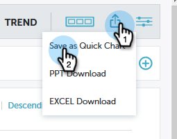
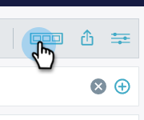
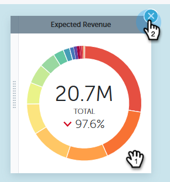

# [!UICONTROL Performance Insights] [!UICONTROL Schnelldiagramme] {#performance-insights-quick-charts}

[!UICONTROL Schnelldiagramme] sind Miniaturansichten, die Sie anpassen und speichern können und die eine Schnellansicht der Diagramme bieten, die Sie am häufigsten verwenden.

## Neues Schnelldiagramm erstellen {#create-a-new-quick-chart}

[!UICONTROL Schnelldiagramme] werden aus den von Ihnen angegebenen Daten abgeleitet. In diesem Beispiel wählen wir: **Neue Opportunities (Erstkontakt), Opportunity-Typ = Neues Unternehmen, aktuelles Jahr bis heute**.

1. Klicken Sie auf den Datumsfilter und wählen Sie **[!UICONTROL Aktuelles Jahr (YTD)]**.

   

1. Klicken Sie auf **+** und wählen Sie Ihre Kriterien aus.

   

1. Das Diagramm wird aktualisiert und zeigt die ausgewählten Filter an.

   

1. Klicken Sie auf das Symbol Exportieren und wählen **[!UICONTROL Als Schnelldiagramm speichern]**.

   

1. Benennen Sie Ihr Schnelldiagramm und klicken Sie auf **[!UICONTROL Speichern]**.

   

Ihr Schnelldiagramm ist jetzt mit den anderen verfügbar.

>[!NOTE]
>
>Sie können bis zu 20 Schnelldiagramme haben. Sie können gelöscht und ersetzt werden.

## Anzeigen vorhandener Schnelldiagramme {#view-existing-quick-charts}

1. Um Ihre vorhandenen Schnelldiagramme anzuzeigen, klicken Sie einfach auf das Symbol **[!UICONTROL Schnelldiagramme]**.

   

## Löschen eines Schnelldiagramms {#delete-a-quick-chart}

Wenn Sie ein Schnelldiagramm löschen müssen, führen Sie die folgenden einfachen Schritte aus.

1. Klicken Sie auf **[!UICONTROL Symbol]** Schnelldiagramme“.

   

1. Bewegen Sie den Mauszeiger über das gewünschte Diagramm, aber klicken Sie nicht darauf. Beim Bewegen des Mauszeigers wird ein X angezeigt. Klicken Sie auf **X**.

   

1. Klicken Sie auf **[!UICONTROL Löschen]**.

   
