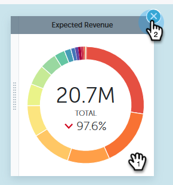

# Schnelldiagramme zu Leistungseinblicken {#performance-insights-quick-charts}

Schnelldiagramme sind Miniaturansichten, die Sie anpassen und speichern, um eine schnelle Ansicht der Diagramme zu ermöglichen, die Sie am häufigsten verwenden.

## Neues Schnelldiagramm erstellen {#create-a-new-quick-chart}

Schnelldiagramme leiten sich von den von Ihnen angegebenen Daten ab. In diesem Beispiel wählen wir Folgendes: **neue Möglichkeiten (Erstkontakt), Opportunity type = neues Geschäft, aktuelles Jahr-zu-Datum**.

1. Klicken Sie auf den Datumsfilter und wählen Sie **Aktuelles Jahr (YTD)**.

   

1. Klicken Sie auf **+** und wählen Sie Ihre Kriterien aus.

   

1. Das Diagramm wird entsprechend den ausgewählten Filtern aktualisiert.

   

1. Klicken Sie auf das Symbol Exportieren und wählen Sie **Als Schnelldiagramm speichern**.

   

1. Benennen Sie Ihr Schnelldiagramm und klicken Sie auf **Speichern**.

   

Ihr Schnelldiagramm ist jetzt mit den anderen verfügbar.

>[!NOTE]
>
>Sie können bis zu 20 Schnelldiagramme haben. Sie können gelöscht und ersetzt werden.

## Vorhandene Schnelldiagramme anzeigen {#view-existing-quick-charts}

1. Um Ihre vorhandenen Schnelldiagramme anzuzeigen, klicken Sie einfach auf **Schnelldiagramme** Symbol.

   

## Schnelldiagramm löschen {#delete-a-quick-chart}

Wenn Sie ein Schnelldiagramm löschen müssen, führen Sie die folgenden einfachen Schritte aus.

1. Klicken Sie auf **Schnelldiagramme** Symbol.

   

1. Bewegen Sie den Mauszeiger über das gewünschte Diagramm, klicken Sie jedoch nicht darauf. Beim Bewegen des Mauszeigers wird ein X angezeigt. Klicken Sie auf **X**.

   

1. Klicks **Löschen**.

   
