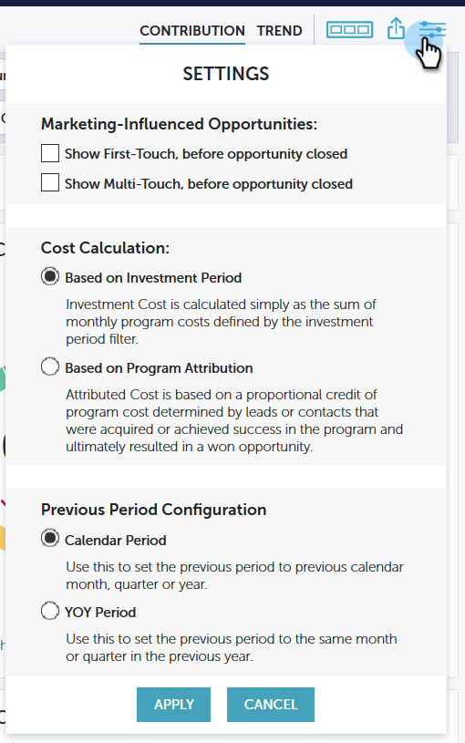

# Leistungseinblicke - Einstellungen {#performance-insights-settings}

Erfahren Sie mehr über die verschiedenen Einstellungsoptionen in MPI.

>[!NOTE]
>
>Je nachdem, in welchem Dashboard Sie sich befinden, werden Ihnen unterschiedliche Einstellungsoptionen angezeigt.

## Programmerfolg anzeigen nach {#view-program-success-by}

**Interaktions-Dashboard - Beitrag und Trend**

<table> 
 <tbody> 
  <tr> 
   <td><strong>Kostenzeitraum</strong></td> 
   <td>Wenn Sie diese Option aktivieren, aggregieren Performance Insights alle neuen Namen und Erfolge zurück zu dem Monat, der als Kostenzeitraum eingerichtet wurde.</td> 
  </tr> 
  <tr> 
   <td><strong>Aktivitätszeitraum</strong></td> 
   <td>Wenn Sie diese Option aktivieren, aggregieren Performance Insights alle neuen Namen, Erfolge und Mitgliedschaften nach Aktivitätsdatum, unabhängig vom Programmkostenzeitraum.</td> 
  </tr> 
 </tbody> 
</table>

## Konfiguration vorheriger Zeitraum {#previous-period-configuration}

**Interaktion, Pipeline, Umsatz-Dashboards - Nur Beiträge**

<table> 
 <tbody> 
  <tr> 
   <td><strong>Kalenderzeitraum</strong></td> 
   <td>Setzen Sie den vorherigen Zeitraum auf: Vorheriger Kalendermonat, -quartal oder -jahr.</td> 
  </tr> 
  <tr> 
   <td><strong>Jahresübergreifender Zeitraum</strong></td> 
   <td>Stellen Sie den vorherigen Zeitraum auf denselben Monat oder dasselbe Quartal im Vorjahr ein.</td> 
  </tr> 
 </tbody> 
</table>

## Durch Marketing beeinflusste Chancen {#marketing-influenced-opportunities}

**Pipeline-Dashboard - Beitrag und Trend**

<table> 
 <tbody> 
  <tr> 
   <td><strong>Erstkontakt anzeigen, bevor eine Gelegenheit erstellt wurde</strong></td> 
   <td>
Wenn Sie dies überprüfen, umfasst MPI Chancen, die mit mindestens einem Lead verknüpft sind, der von einem Marketo-Programm vor der Schaffung der Gelegenheit erworben wurde (Erstkontakt/FT). Die Attributionseinstellungen Explizit, Implizit und Hybrid gelten.
</td> 
  </tr> 
  <tr> 
   <td><strong>Multi-Touch anzeigen, bevor eine Gelegenheit erstellt wurde</strong></td> 
   <td>
Wenn Sie dies überprüfen, bietet MPI Möglichkeiten mit mindestens einem Lead, der von einem Marketo-Programm erworben wurde (Multi-Touch/MT), bevor die Gelegenheit geschaffen wurde. Die Attributionseinstellungen Explizit, Implizit und Hybrid gelten.
</td> 
  </tr> 
 </tbody> 
</table>

**Umsatz-Dashboard - Beitrag und Trend**

<table> 
 <tbody> 
  <tr> 
   <td><strong>Erstkontakt anzeigen, bevor die Gelegenheit geschlossen wird</strong></td> 
   <td>
Wenn Sie dies überprüfen, umfasst MPI Chancen, die mit mindestens einem Lead verbunden sind, der von einem Marketo-Programm erworben wurde (Erstkontakt/FT), bevor die Gelegenheit geschlossen wurde. Die Attributionseinstellungen Explizit, Implizit und Hybrid gelten.
</td> 
  </tr> 
  <tr> 
   <td><strong>Multi-Touch anzeigen, bevor die Gelegenheit geschlossen wird</strong></td> 
   <td>
Wenn Sie dies überprüfen, bietet MPI Möglichkeiten mit mindestens einem Lead, der von einem Marketo-Programm erworben wurde (Multi-Touch/MT), bevor die Gelegenheit geschlossen wurde. Die Attributionseinstellungen Explizit, Implizit und Hybrid gelten.
</td> 
  </tr> 
 </tbody> 
</table>

## Kostenkalkulation {#cost-calculation}

**Pipeline- und Umsatz-Dashboards - Beitrag und Trend**

<table> 
 <tbody> 
  <tr> 
   <td><strong>Basierend auf dem Investitionszeitraum</strong></td> 
   <td>Die Investitionskosten werden einfach als Summe der monatlichen Programmkosten berechnet, die durch den Investitionszeitraumfilter definiert werden.</td> 
  </tr> 
  <tr> 
   <td><strong>Basierend auf der Programmzuweisung</strong></td> 
   <td>Die zugewiesenen Kosten basieren auf einem Anteil der Programmkosten, der durch Leads oder Kontakte bestimmt wird, die im Programm erworben wurden oder Erfolg erzielt haben und letztendlich zu einer erfolgreichen Möglichkeit geführt haben.</td> 
  </tr> 
 </tbody> 
</table>
