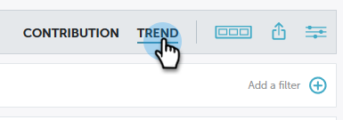
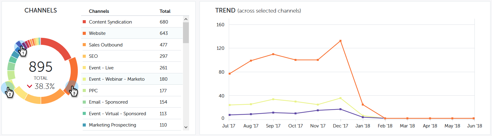

# Trend-Übersicht für Leistungseinblicke {#performance-insights-trend-overview}

Trend zeigt die Kanalleistung von über einen Zeitraum hinweg an.

Klicken Sie auf die Registerkarte **Trend** , um auf diese Ansicht zuzugreifen.

## Trend {#trend}

Wählen Sie die Metrik aus, nach der Sie die Leistung anzeigen möchten. In diesem Beispiel werden wir uns die Chancen ansehen, die durch [Erstkontakt](/help/marketo/product-docs/reporting/revenue-cycle-analytics/revenue-tools/attribution/understanding-attribution.md) gewonnen wurden.

Die Metriken werden in zwei Diagrammen dargestellt: Doppel- und Liniendiagramm.

Das Doppeldiagramm zeigt die Top-10-Kanäle für die ausgewählte Metrik an.

Das Liniendiagramm zeigt den Kanal-Leistungstrend für die Metrik an, die Sie in den letzten 12 Monaten ausgewählt haben.

Wählen Sie einen oder mehrere Kanäle aus. Das Liniendiagramm zeigt den Kanaltrend an. Klicken Sie erneut auf die Kanäle, um die Auswahl aufzuheben.

Das unten stehende Datenraster funktioniert wie eine Tabelle, die alle verfügbaren Trenddaten für die Metrik anzeigt, die Sie in den letzten 12 Monaten ausgewählt haben.

Erweitern Sie einen Kanal, um die zehn wichtigsten Programme zu sehen, wobei die restlichen Programme kombiniert werden.

>[!NOTE]
>
>Wenn Sie auf das Kontrollkästchen neben einem Kanal klicken, wird dieser im Zweierdiagramm aktiviert/deaktiviert.
