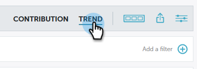

# [!UICONTROL Performance Insights] Trend-Übersicht {#performance-insights-trend-overview}

[!UICONTROL Trend] zeigt die Kanalleistung von über einen bestimmten Zeitraum an.

Klicken Sie auf die **[!UICONTROL Trend]**, um auf diese Ansicht zuzugreifen.

## [!UICONTROL Trend] {#trend}

Wählen Sie die Metrik aus, nach der Sie die Leistung anzeigen möchten.

Die Metriken werden in zwei Diagrammen angezeigt: Ring und Linie.

Das Ringdiagramm zeigt die zehn wichtigsten Kanäle für die ausgewählte Metrik.

Das Liniendiagramm zeigt den Kanal-Performance-Trend für die Metrik an, die Sie in den letzten 12 Monaten ausgewählt haben.

Wählen Sie einen oder mehrere Kanäle aus, und das Liniendiagramm zeigt den Kanaltrend an. Klicken Sie erneut auf den/die Kanal/Kanäle, um die Auswahl aufzuheben.

Das nachstehende Datenraster funktioniert wie eine Tabelle und zeigt alle verfügbaren Trenddaten für die Metrik an, die Sie für die letzten 12 Monate ausgewählt haben.

Erweitern Sie einen Kanal, um die zehn wichtigsten Programme anzuzeigen, wobei die verbleibenden Programme kombiniert werden.

>[!NOTE]
>
>Wenn Sie auf das Kontrollkästchen neben einem Kanal klicken, wird dieser im Ringdiagramm aktiviert/deaktiviert.
