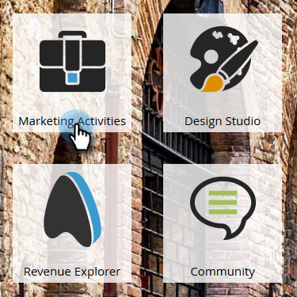

# Einrichten von Leistungseinblicken {#setting-up-performance-insights}

Gehen Sie wie folgt vor, um MPI einzurichten.

## Einrichtung von Chancen {#opportunity-setup}

1. Klicken Sie auf **Admin**.

   

1. Klicken Sie auf **Umsatzzyklusanalysen**.

   

   >[!NOTE]
   >
   >Wenn Sie keine RCA haben, müssen Sie für Schritt 2 die Option **Programmanalyse** auswählen.

1. Klicken Sie unter &quot;Attribution&quot;auf **Bearbeiten**.

   

1. Die Attributionseinstellungen werden angezeigt.

   

   Wenn die Attribution explizit ist, stellen Sie sicher, dass die Kontaktrolle &quot;Chancen&quot;ausgefüllt wurde (entweder über den Endpunkt &quot;Angebotsrolle&quot;oder über die CRM-Integration).

   Wenn Attribution implizit ist, stellen Sie sicher, dass das Unternehmensfeld auf dem Lead/Kontakt mit dem Kontonamen der Opportunity übereinstimmt.

   >[!NOTE]
   >
   >Stellen Sie sicher, dass alle Möglichkeiten die entsprechenden Felder ausgefüllt haben:
   >
   >* Opportunity-Betrag
   >* Ist geschlossen
   >* Ist gewonnen
   >* Erstellungsdatum (in Ihrem Fall kann dies nicht festgelegt werden)
   >* Geschlossenes Datum (in Ihrem Fall kann dies nicht festgelegt werden)
   >* Opportunity-Typ

## Programm-Installation {#program-setup}

Aktualisieren Sie die Programmkosten für mindestens 12 Monate. Sie können dies manuell oder mithilfe der Programm-API tun. In diesem Beispiel machen wir es manuell.

1. Klicken Sie auf **Marketingaktivitäten**.

   

1. Wählen Sie Ihr Programm aus.

   

1. Klicken Sie auf die Registerkarte **Setup**.

   

1. Ziehen Sie **Period Cost** auf die Arbeitsfläche.

   

1. Legen Sie den Programmmonat vor mindestens 12 Monaten fest und klicken Sie auf **OK**.

   

1. Legen Sie die Zeitraumkosten fest und klicken Sie auf **Speichern**.

   

Überprüfen Sie anschließend das Analytics-Verhalten, um anzugeben, ob ein bestimmter Kanal in die Analyse einbezogen werden soll. Legen Sie das Analytics-Verhalten fest (Normal, Einschließen, Operativ).

1. Klicken Sie auf **Admin**.

   

1. Klicken Sie auf **Tags**.

   

1. Klicken Sie auf &quot;**+**&quot;, um die Kanalliste zu erweitern.

   

1. Doppelklicken Sie auf den gewünschten Kanal.

   

1. Klicken Sie auf die Dropdownliste **Analytics-Verhalten** und wählen Sie das gewünschte Verhalten aus.

   

1. Festlegen der Erfolgskriterien.

   

1. Klicken Sie auf **Speichern**.

   

## das Programm an die Person binden {#tie-the-program-to-the-person}

1. Stellen Sie sicher, dass das Akquiseprogramm und das Akquisedatum für jede Person in Ihrer Datenbank festgelegt wurden, damit die Erstkontaktzuordnung funktioniert.
1. Stellen Sie sicher, dass Ihre Programme Erfolgsstatus für Ihre Menschen festlegen.

>[!NOTE]
>
>Die vorgenommenen Änderungen sind nicht unmittelbar. Bevor Änderungen wirksam werden, ist eine Übernachtungsperiode erforderlich.
