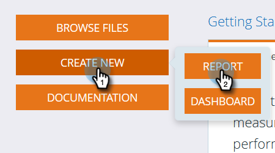
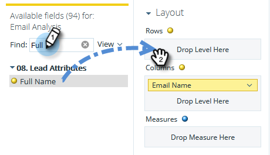

# Erstellen eines E-Mail-Analyseberichts mit einer Liste der Leads {#build-an-email-analysis-report-that-lists-leads}

Führen Sie diese Schritte aus, um einen E-Mail-Analysebericht zu erstellen, der alle Leads anzeigt, die mit einer bestimmten E-Mail gesendet wurden. Dieser Bericht enthält auch die Statistiken Klick und Öffnen .

>[!AVAILABILITY]
>
>Nicht jeder hat diese Funktion erworben. Weitere Informationen erhalten Sie beim Adobe Account Team (Ihrem Account Manager).

>[!NOTE]
>
>Die Daten-Engine, die E-Mail-Analyse unterstützt, ignoriert mehr als 12 Klicks pro Person, wenn sie von derselben E-Mail und Kampagne stammen. Bitte berücksichtigen Sie dies beim Vergleich von E-Mail-Analyseberichten mit standardmäßigen Marketo Analytics-Berichten.

1. Starten Sie **[!UICONTROL Umsatz-Explorer]**.

   

1. Klicken Sie **[!UICONTROL Neu erstellen]** und dann **[!UICONTROL Bericht]**.

   

1. Wählen Sie **[!UICONTROL E-Mail-Analyse]** und klicken Sie auf **[!UICONTROL OK]**.

   

1. Suchen Sie den gelben Punkt **[!UICONTROL E]** Mail-Name“, klicken Sie mit der rechten Maustaste darauf und wählen Sie **[!UICONTROL Filtern…]**.

   

1. Doppelklicken Sie auf die gewünschte E-Mail in der Liste und klicken Sie auf **[!UICONTROL OK]**.

   

1. Ziehen Sie den **[!UICONTROL E-Mail-Name]** gelben Punkt auf **[!UICONTROL Spalten]**.

   

   >[!TIP]
   >
   >Es gibt viele Lead-/Firmenattribute, die Sie als Spalten hinzufügen können. Sehen Sie sie sich an!

1. Suchen Sie den **[!UICONTROL Vollständiger Name]** gelben Punkt und ziehen Sie ihn auf **[!UICONTROL Zeilen]**.

   

1. Fügen Sie nun die **[!UICONTROL Kennzahlen]** hinzu, an denen Sie interessiert sind, indem Sie darauf doppelklicken.

   

>[!NOTE]
>
>Je nach Datenmenge kann es eine Weile dauern, bis dieser Bericht aktualisiert wird.

Mission abgeschlossen!
