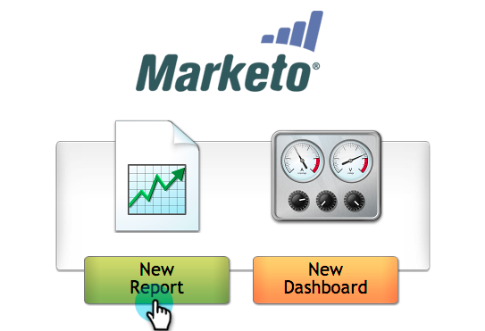

# Erstellen Sie einen Bericht zur E-Mail-Analyse, der Programm-Informationen {#build-an-email-analysis-report-that-shows-program-information} anzeigt.

Führen Sie folgende Schritte aus, um einen Bericht zur E-Mail-Analyse zu erstellen, der E-Mail-Informationen nach Programm-Kanälen gruppiert anzeigt.

>[!AVAILABILITY]
>
>
>Nicht alle Kunden haben diese Funktion erworben. Weitere Informationen erhalten Sie von Ihrem Vertriebsmitarbeiter.

1. Starten Sie **Umsatz-Explorer**.

   

1. Klicken Sie auf **Neuer Bericht**.

   

1. Wählen Sie** E-Mail-Analyse** aus und klicken Sie auf **OK**.

   

1. Suchen Sie den gelben Punkt **Gesendet (Woche)** und klicken Sie mit der rechten Maustaste darauf. Klicken Sie auf **Filter**.

   >[!NOTE]
   >
   >Dadurch wird der Zeitrahmen des Berichts verkürzt.

   

1. Markieren Sie **Aktuelle gesendete Woche** und klicken Sie auf **OK**.

   

1. Suchen und Dublette klicken Sie auf den** Programm Kanal** gelben Punkt.

   

1. Suchen und Dublette klicken Sie auf den gelben Punkt **E-Mail-Name**.

   

1. Klicken Sie auf die blauen Punkte **Gesendet**, **Geöffnet** und **Klicken Sie auf**.

   

   Gute Arbeit! Sie sollten einen Bericht haben, der in etwa so aussieht:

   

   >[!NOTE]
   >
   >**Tieftauchen**
   >
   >
   >Möchten Sie mehr über [Umsatz-Cycle Explorer](http://docs.marketo.com/display/docs/revenue+cycle+analytics) erfahren?

