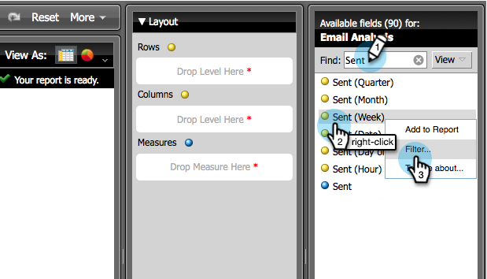

# Erstellen eines E-Mail-Analyseberichts mit Programminformationen {#build-an-email-analysis-report-that-shows-program-information}

Gehen Sie wie folgt vor, um einen E-Mail-Analysebericht zu erstellen, der E-Mail-Informationen nach Programmkanälen gruppiert anzeigt.

>[!AVAILABILITY]
>
>Nicht jeder hat diese Funktion erworben. Weitere Informationen erhalten Sie beim Adobe Account Team (Ihrem Account Manager).

1. Starten Sie **[!UICONTROL Umsatz-Explorer]**.

   

1. Klicken Sie **[!UICONTROL Neu erstellen]** und wählen Sie **[!UICONTROL Bericht]**.

   

1. Wählen Sie **[!UICONTROL Bereich]** E-Mail-Analyse“ aus und klicken Sie auf **[!UICONTROL OK]**.

   

1. Suchen Sie den gelben Punkt **[!UICONTROL Gesendet (Woche]** und klicken Sie mit der rechten Maustaste darauf. Klicken Sie **[!UICONTROL Filtern…]**.

   >[!NOTE]
   >
   >Dadurch wird der Zeitrahmen des Berichts eingegrenzt.

   

1. Markieren Sie **[!UICONTROL Aktuell gesendet (Woche)]** und klicken Sie auf **[!UICONTROL OK]**.

   

1. Suchen Sie nach dem gelben Punkt **[!UICONTROL Programmkanal]** und doppelklicken Sie darauf.

   

1. Suchen Sie nach dem gelben Punkt **[!UICONTROL E-Mail]** Name und doppelklicken Sie darauf.

   

1. Suchen Sie nach den blauen Punkten **[!UICONTROL Gesendet]**, **[!UICONTROL Geöffnet]** und **[!UICONTROL Angeklickt]** und doppelklicken Sie darauf.

   

   Gut gemacht! Sie sollten einen Bericht haben, der in etwa wie folgt aussieht:

   
