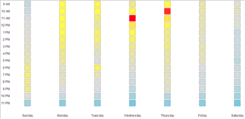

# Der Bereich &quot;E-Mail-Analyse&quot; {#understanding-the-email-analysis-area}

Der Bereich &quot;E-Mail-Analyse&quot;konzentriert sich auf E-Mail-Metriken. In diesem Artikel werden alle darin verfügbaren Berichte vorgestellt.

>[!AVAILABILITY]
>
>Dies ist für Benutzer mit dem Add-on Select Edition oder dem Add-on [Umsatz-Zyklusanalysen](https://www.marketo.com/global-enterprise/marketo-revenue-cycle-analytics/) verfügbar. Detaillierte Informationen erhalten Sie vom zuständigen Vertriebsmitarbeiter.

## E-Mail-Klick-Aktivitäts-Heatraster {#email-click-activity-heat-grid}

Dieser Bericht zeigt Ihnen, an welchem Wochentag und zu welcher Uhrzeit Ihre Leads auf E-Mails klicken. Je grüner die Kiste ist, desto mehr Klicks sind an diesem bestimmten Tag und zu dieser bestimmten Uhrzeit zu sehen. Der aktuelle Filter enthält alle E-Mails, die in den letzten sieben Tagen gesendet wurden. Die Zeit ist im CST-Format.

## E-Mail angeklickte Zeitverteilung {#email-clicked-time-distribution}

Dieser Bericht zeigt Ihnen den Prozentsatz der E-Mail-Klicks insgesamt für jede Tageszeit. Der aktuelle Filter enthält alle E-Mails, die in den letzten sieben Tagen gesendet wurden. Die Zeit ist im CST-Format.

## Rückgang der E-Mail-Klickrate {#email-click-rate-decay}

Dieser Bericht zeigt Ihnen, wie hoch der Prozentsatz der E-Mail-Klicks insgesamt ist, die an dem Tag stattgefunden haben, an dem eine E-Mail gesendet wird, sowie an den darauf folgenden Tagen. Der aktuelle Filter enthält alle E-Mails, die vor 7 Tagen gesendet wurden.

## Offenes Aktivitäts-Heattraster per E-Mail {#email-open-activity-heat-grid}

Dieser Bericht zeigt Ihnen, an welchem Wochentag und zu welcher Tageszeit Ihre Leads E-Mails öffnen. Je grüner die Kiste ist, desto mehr wird an diesem bestimmten Tag und zu dieser bestimmten Uhrzeit geöffnet. Der aktuelle Filter enthält alle E-Mails, die in den letzten sieben Tagen gesendet wurden. Die Zeit ist im CST-Format.

## Abnahme der Öffnungsrate {#open-rate-decay}

Dieser Bericht zeigt Ihnen, wie hoch der Prozentsatz der E-Mail-Öffnungen ist, die an dem Tag, an dem eine E-Mail gesendet wird, und an den darauf folgenden Tagen stattgefunden haben. Der aktuelle Filter enthält alle E-Mails, die vor 7 Tagen gesendet wurden.

## Open Time Distribution {#open-time-distribution}

Dieser Bericht zeigt Ihnen den Prozentsatz der Gesamt-E-Mail-Öffnungen für jede Tageszeit. Der aktuelle Filter enthält alle E-Mails, die in den letzten sieben Tagen gesendet wurden. Die Zeit ist im CST-Format.

## Gesendetes Aktivitäts-Heattraster {#sent-activity-heat-grid}

Dieser Bericht zeigt Ihnen, an welchem Wochentag und zu welcher Uhrzeit Sie Ihre E-Mails versenden. Je grüner die Box ist, desto mehr gesendete E-Mails an dem jeweiligen Tag und zur bestimmten Uhrzeit. Der aktuelle Filter enthält alle E-Mails, die in den letzten sieben Tagen gesendet wurden. Die Zeit ist im CST-Format.

