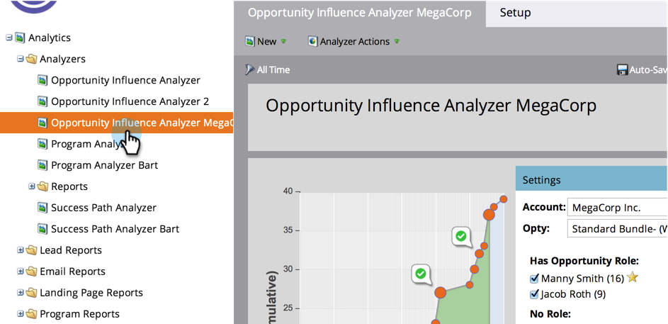
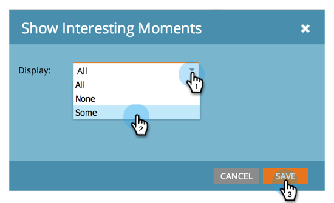

# Konfigurieren eines Analyzers für Opportunity-Einfluss {#configure-an-opportunity-influence-analyzer}

Nachdem Sie [Opportunity Influence Analyzer erstellt haben](/help/marketo/product-docs/reporting/revenue-cycle-analytics/opportunity-influence-analyzer/create-an-opportunity-influence-analyzer.md) können Sie die enthaltenen Typen [interessanter ](/help/marketo/product-docs/marketo-sales-insight/msi-for-salesforce/features/tabs-in-the-msi-panel/interesting-moments/interesting-moments-overview.md)&quot; konfigurieren.

>[!PREREQUISITES]
>
>[Erstellen eines Opportunity Influence Analyzer](/help/marketo/product-docs/reporting/revenue-cycle-analytics/opportunity-influence-analyzer/create-an-opportunity-influence-analyzer.md)

1. Klicken Sie auf **[!UICONTROL Analytics]**.

   

1. Wechseln Sie zu **[!UICONTROL Analytics]** und wählen Sie Ihren Opportunity Influence Analyzer aus.

   

   Wenn das Analyzer-Diagramm zu viele interessante Momente enthält, können Sie diese reduzieren, indem Sie die Auswahl der Personen im Bedienfeld **[!UICONTROL Einstellungen]** aufheben oder die Anzahl der interessanten Momente reduzieren.

1. Um zu konfigurieren, welche Arten von interessanten Momenten einbezogen werden sollen, gehen Sie zur Registerkarte **[!UICONTROL Setup]** und ziehen Sie den Filter **[!UICONTROL Interessante Momente]** ein.

   

1. Wählen Sie aus, ob **[!UICONTROL Alle]**, **[!UICONTROL Keine]** oder **[!UICONTROL Einige]** angezeigt werden soll.

   

1. Wenn Sie **[!UICONTROL Einige]** auswählen, können Sie dann auswählen, welche Typen einbezogen werden sollen.

   

1. Klicken Sie auf jede Art von interessanten Momenten, die Sie möchten. Klicken Sie dann auf **[!UICONTROL Speichern]**.

1. Klicken Sie auf die Hauptregisterkarte, um den Verlauf der Opportunity mit nur den ausgewählten Arten von interessanten Momenten anzuzeigen.

   

>[!MORELIKETHIS]
>
>[Erzählen Sie die Marketing-Story mit einem Opportunity Influence Analyzer](/help/marketo/product-docs/reporting/revenue-cycle-analytics/opportunity-influence-analyzer/tell-the-marketing-story-with-an-opportunity-influence-analyzer.md)
