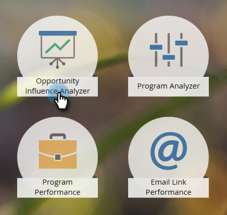

# Erstellen eines Opportunity Influence Analyzer {#create-an-opportunity-influence-analyzer}

Verwenden Sie den Opportunity Influence Analyzer, um den Beitrag des Marketings zu einem wichtigen Geschäft anzuzeigen. Sehen Sie Ihre Programm- und Veranstaltungserfolge sowie interessante Momente im Leben einer Chance.

>[!NOTE]
>
>Um gute Informationen von einem Opportunity Influence Analyzer zu erhalten, stellen Sie sicher, dass Ihre Kontakte mit den Opportunities in Ihrem CRM verknüpft sind.

1. Klicken Sie auf **[!UICONTROL Analytics]**.

   

1. Klicken Sie **[!UICONTROL Opportunity Influence Analyzer]**.

   

1. Wählen Sie das Konto im Bedienfeld **[!UICONTROL Einstellungen]** aus.

   

   >[!NOTE]
   >
   >Wenn Sie eine Warnung erhalten, dass im Zeitrahmen keine Aktivitäten vorhanden waren, klicken Sie einfach auf **[!UICONTROL Schließen]**. Wir werden darauf nach dem nächsten Schritt zurückkommen.

1. Wählen Sie die Opportunity in diesem Konto aus.

   

1. Den Zeitraum festlegen. Klicken Sie auf **[!UICONTROL Registerkarte]** und doppelklicken Sie auf **[!UICONTROL Zeitrahmen]**.

   

1. Wählen Sie den Zeitraum der Opportunity aus, die Sie analysieren möchten, und klicken Sie auf **[!UICONTROL Speichern]**.

   

   >[!TIP]
   >
   >
   >In den meisten Fällen ist **[!UICONTROL All Time]** die einfachste Wahl.

1. Du bist da! Klicken Sie auf die Registerkarte Haupt , um die interessanten Momente und Erfolge anzuzeigen, die an der Opportunity beteiligt sind.

   

>[!TIP]
>
>Sie können auch ein Video über den Opportunity Influence Analyzer in der [Marketo University](https://learn.marketo.com) ansehen. (Es sieht jetzt ein wenig anders aus, aber es gibt noch viel zu lernen!)

>[!MORELIKETHIS]
>
>* [Erzählen Sie die Marketing-Story mit einem Opportunity Influence Analyzer](/help/marketo/product-docs/reporting/revenue-cycle-analytics/opportunity-influence-analyzer/tell-the-marketing-story-with-an-opportunity-influence-analyzer.md)
>* [Konfigurieren eines Opportunity Influence Analyzer](/help/marketo/product-docs/reporting/revenue-cycle-analytics/opportunity-influence-analyzer/configure-an-opportunity-influence-analyzer.md)
