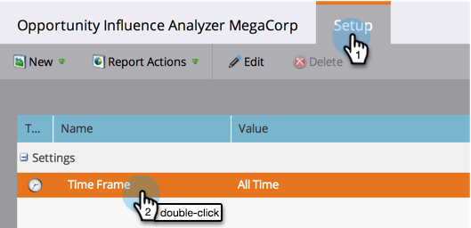

# Erstellen eines Einflussanalysators {#create-an-opportunity-influence-analyzer}

Verwenden Sie den &quot;Opportunity Influence Analyzer&quot;, um den Beitrag des Marketing zu einem wichtigen Geschäft zu zeigen. Sehen Sie sich Ihre Programm- und Ereignis-Erfolge sowie interessante Momente im Leben einer Gelegenheit an.

>[!NOTE]
>
>**Erinnerung**
>
>Um sich ein gutes Intel von einem Opportunity Influence Analyzer zu verschaffen, stellen Sie sicher, dass Ihre Kontakte mit den Chancen in Ihrem CRM verbunden sind.

1. Klicken Sie auf **Analytics**.

   

1. Klicken Sie auf **Opportunity Influence Analyzer**.

   

1. Wählen Sie das Konto im **Einstellungsbedienfeld** aus.

   

   >[!NOTE]
   >
   >Wenn Sie eine Warnung erhalten, dass im Zeitraum keine Aktivitäten aufgetreten sind, klicken Sie einfach auf **Schließen**. Wir werden nach dem nächsten Schritt darauf zurückkommen.

1. Wählen Sie die Gelegenheit in diesem Konto aus.

   

1. Legen Sie den Zeitraum fest. Klicken Sie auf die Registerkarte &quot; **Einstellungen** &quot;und klicken Sie bei Dublette auf &quot; **Zeitraum**&quot;.

   

1. Wählen Sie den Zeitraum der Gelegenheit aus, die Sie analysieren möchten, und klicken Sie auf **Speichern**.

   

   >[!TIP]
   >
   >
   >In den meisten Fällen ist **All Time** die einfachste Wahl.

1. Du bist da! Klicken Sie auf die Registerkarte &quot;Haupt&quot;, um die interessanten Momente und Erfolge zu sehen, die mit der Gelegenheit verbunden sind.

   

>[!TIP]
>
>Sie können sich auch ein Video über den Opportunity Influence Analyzer in der [Universität](https://learn.marketo.com)Marketo ansehen. (Es sieht jetzt ein bisschen anders aus, aber es gibt noch viel zu lernen!)

>[!NOTE]
>
>**Verwandte Artikel**
>
>* [Erzählen Sie die Marketing Story mit einem Einflussanalysator für Chancen](tell-the-marketing-story-with-an-opportunity-influence-analyzer.md)
>* [Einen Einflussanalysator für Chancen konfigurieren](configure-an-opportunity-influence-analyzer.md)

>

>[!NOTE]
>
>**Tieftauchen**
>
>Weitere Informationen zu Analyzern finden Sie unter [Grundlegender Berichte](http://docs.marketo.com/display/docs/basic+reporting).

