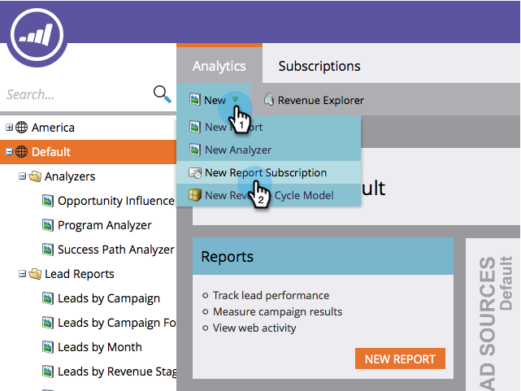
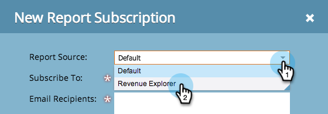
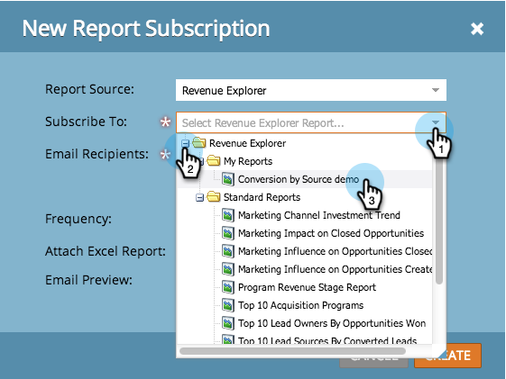

# Exportieren von Daten des Analyzers für Opportunity-Einfluss {#export-opportunity-influence-analyzer-data}

Um Aktualisierungen aus Ihren Revenue Cycle Explorer-Berichten zu erhalten und freizugeben, können Sie jede E-Mail-Adresse für einen vorhandenen Bericht abonnieren.

1. Navigieren Sie zu **[!UICONTROL Analytics]** und wählen Sie **[!UICONTROL Neu]** > **[!UICONTROL Neues Berichtsabonnement]**.

   

   >[!NOTE]
   >
   >Informationen zum Abonnieren eines Basisberichts, den Sie in einem Programm erstellt haben, finden Sie unter [Abonnieren eines Basisberichts](/help/marketo/product-docs/reporting/basic-reporting/report-subscriptions/subscribe-to-a-basic-report.md).

1. Wählen **[!UICONTROL für Report]** die Option **[!UICONTROL Umsatz-Explorer]**.

   

1. Navigieren Sie in der Ordnerstruktur und wählen Sie den Bericht aus.

   

1. Geben Sie die E-Mail-Adresse(n) ein und legen Sie die Häufigkeit der Berichts-E-Mails fest.

   

   >[!NOTE]
   >
   >Jeder kann sich von dem Bericht in der erhaltenen E-Mail abmelden.

1. Ihr Abonnement ist festgelegt! Wenn Sie Ihre eigene E-Mail-Adresse angegeben haben, erhalten Sie den Bericht per E-Mail.

   

>[!MORELIKETHIS]
>
>Erfahren Sie[&#x200B; wie Sie alle Berichtsabonnements &#x200B;](/help/marketo/product-docs/reporting/basic-reporting/report-subscriptions/manage-report-subscriptions.md) verwalten können.
