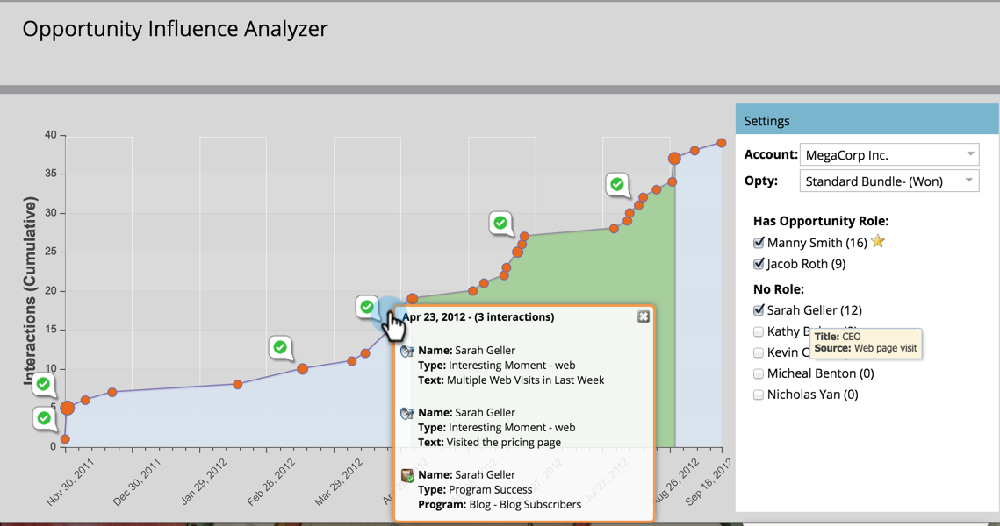

# Erzählen Sie die Marketing-Story mit einem [!UICONTROL Opportunity Influence Analyzer] {#tell-the-marketing-story-with-an-opportunity-influence-analyzer}

Verwenden Sie einen [!UICONTROL Opportunity Influence Analyzer] um die Rolle des Marketings bei wichtigen Opportunitys zu veranschaulichen. Zeigen Sie, wie Marketing eine Opportunity beeinflusst hat, vom ersten Kontakt bis zur Erstellung und zum Gewinn von Opportunities und darüber hinaus.

>[!PREREQUISITES]
>
>[Erstellen eines [!UICONTROL Opportunity Influence Analyzer]](/help/marketo/product-docs/reporting/revenue-cycle-analytics/opportunity-influence-analyzer/create-an-opportunity-influence-analyzer.md)

1. Wechseln Sie zu **[!UICONTROL Analytics]** und wählen Sie den **[!UICONTROL Opportunity Influence Analyzer]** aus.

   

   Der [!UICONTROL Opportunity Influence Analyzer] ist eine visuelle Darstellung der Interaktionen und Programm- und Ereigniserfolge, die mit dieser Opportunity verbunden sind. Sehen wir uns das Diagramm an:

   *  **Orange Dots** stellen interessante Momente in der Opportunity dar (geöffnete E-Mails, Besuche auf Messen, Downloads von Whitepapers usw.). Größere Punkte zeigen mehr Interaktionen an.

   *  **Binder-Symbole** zeigen Programmerfolge an.

   *  **Kalendersymbole** weisen auf erfolgreiche Ereignisse hin.

   * **Opportunity-Zeitraum**. Die grüne Fläche stellt die Chance selbst dar, von der Schaffung der Chance bis zum Abschluss der Chance (gewonnen oder verloren).

   * **Opportunity-Lebenszyklus**. Die Grauzonen vor und nach der grünen Opportunity zeigen die Interaktionen, die zur Opportunity geführt haben und ihr gefolgt sind.

   Das **[!UICONTROL Einstellungen]**-Bedienfeld listet die Personen aus dem Konto auf:

   * Die **Zahl in Klammern** ist die Anzahl der Interaktionen mit diesem Kontakt.

   * Der **gelbe Stern** zeigt den Hauptkontakt an.

1. Bewegen Sie den Mauszeiger über einen Namen, um die Stellenbezeichnung der Person und die Quelle ihrer Beteiligung an der Opportunity anzuzeigen.

   

1. Aktivieren Sie das Kontrollkästchen, um die Interaktionen dieser Person in das Diagramm aufzunehmen.

   

   Das Diagramm wird automatisch angepasst, um ihre Interaktionen bei der Opportunity anzuzeigen. In diesem Beispiel sehen wir sofort, dass MegaCorp-CEO Sarah Geller tief an der Opportunity beteiligt war, obwohl ihr keine Rolle im CRM für die Opportunity zugewiesen war.

1. Klicken Sie auf einen orangefarbenen Punkt, um die Interaktionsdetails anzuzeigen.

   

   In unserem Beispiel erfahren wir, dass CEO Sarah Geller die Website mehrmals besucht und sogar den Blog abonniert hat. Dies deutet darauf hin, dass das Interesse von MegaCorp an der Opportunity zum großen Teil durch Marketing-Programme und -Assets angetrieben wurde.

   Klicken Sie auf weitere orangefarbene Punkte entlang der Timeline, um die Geschichte der Ereignisse, Programme und interessanten Momente auszufüllen, die dazu beigetragen haben, die Opportunity zu erstellen und zu schließen.

   >[!MORELIKETHIS]
   >
   >[Konfigurieren eines [!UICONTROL Opportunity Influence Analyzer]](/help/marketo/product-docs/reporting/revenue-cycle-analytics/opportunity-influence-analyzer/configure-an-opportunity-influence-analyzer.md)
