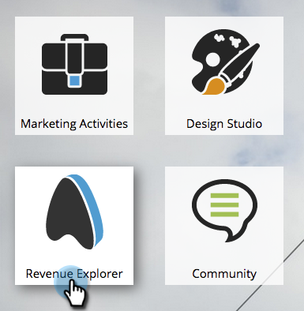
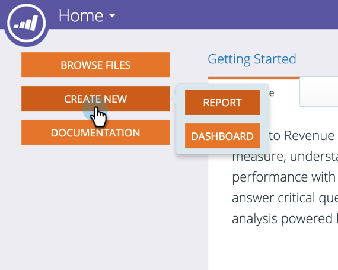
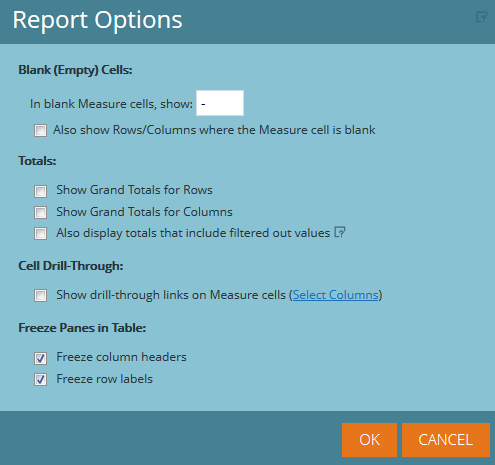

# Überblick über das erweiterte Programm-Reporting {#advanced-program-reporting-overview}

**Revenue Cycle Explorer** umfasst mehrere Analysebereiche und eine breite Palette neuer Metriken, mit denen Sie die Effektivität des Programms messen können.

Es gibt viele Leckereien hier drin. Schauen wir sie uns an!

## Was ist ein Analysebereich? {#whats-an-analysis-area}

Analysebereiche enthalten jeweils verschiedene Datensätze und Metriken im [!UICONTROL Umsatz-Explorer]. Jeder Bereich bezieht sich auf den von Ihnen ausgewählten Berichtssubjekt.

## Programmanalysebereiche {#program-analysis-areas}

* **[Analyse der Programmkosten](understanding-the-program-cost-analysis-area.md)** - Anzeige des ROI für alle Ihre Programme

* **[Analyse der Programmmitgliedschaft](understanding-the-program-membership-analysis-area.md)** - Anzeige der Ergebnisse nach Kanal, Teilnahme, Erfolgskriterien usw.

* **[Programm-Opportunity-Analyse](understanding-the-program-opportunity-analysis-area.md)** - Opportunities, die basierend auf Verteilung, Umsatz und ROI generiert wurden.

* **[Programm-Umsatzstufenanalyse](understanding-the-program-revenue-stage-analysis-area.md)** - Neue Namen, die bestimmte Erfolgsstufen innerhalb Ihres Umsatzzyklusmodells erreicht haben.

## Programm-Analysatoren {#program-analyzers}

* **Programm-Analyzer** - Ermitteln Sie schnell Programme, die erfolgreich sind oder nicht, und fokussieren Sie Ihre Ressourcen entsprechend.

* **Opportunity Influence Analyzer** - Den Beitrag des Marketings nachweisen, indem Sie die Wirkung von Programmen und wichtigen Interaktionen messen, die zu Opportunities geführt haben.

## [!UICONTROL Berichtsoptionen] {#report-options}

In jedem Bericht stehen mehrere Optionen zur Verfügung, mit denen Sie das Erlebnis anpassen können.

>[!CAUTION]
>
>Sie haben zwar die Möglichkeit, Zeilen/Spalten anzuzeigen, in denen die Zelle Kennzahl leer gelassen wird (erstes Kontrollkästchen). Wir raten jedoch davon ab, dies zu tun, da dies die Verarbeitung erheblich verlangsamen und sogar zu einer Zeitüberschreitung des Berichts führen könnte.

>[!NOTE]
>
>Die Daten im Umsatzzyklus-Explorer werden jede Nacht von Ihrer Marketo-Instanz aktualisiert. Daher werden alle Änderungen an Ihren Personen- und Kontoaktivitäten innerhalb von Marketo am folgenden Geschäftstag im Umsatzzyklus-Explorer widergespiegelt.

Wenn Sie sich mit der Umsatzanalyse vertraut machen, erhalten Sie eine vollständige insight zu Ihren Programmen und deren Auswirkungen.
