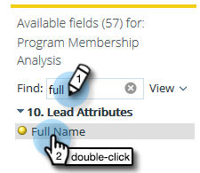

# Erstellen eines Berichts zur Analyse der Programmmitgliedschaft, der Leads auflistet {#build-a-program-membership-analysis-report-that-lists-leads}

Führen Sie diese Schritte aus, um einen Bericht zur Programmteilnahmeanalyse zu erstellen, in dem alle Namen der Programmmitglieder angezeigt werden.

>[!AVAILABILITY]
>
>Nicht alle Kunden haben diese Funktion erworben. Detaillierte Informationen erhalten Sie vom zuständigen Vertriebsmitarbeiter.

1. Launch Umsatz Explorer.

   

1. Klicks **Neu erstellen** then **Bericht**.

   

1. Auswählen **Analyse der Programmmitgliedschaft** und klicken **OK**.

   

1. Doppelklicken Sie auf den gelben Punkt Programmname.

   

1. Doppelklicken Sie auf den blauen Punkt Mitglieder.

   

1. Doppelklicken Sie auf den blauen Punkt Erfolg (Gesamtsumme).

   

Sehen Sie, wie einfach das war?

Sie können schnell ein Lead-Attribut hinzufügen, z. B. _Vollständiger Name_ um zu sehen, wer die Mitglieder sind.

>[!TIP]
>
>Es gibt viele Lead-/Firmenattribute, aus denen Sie auswählen können. Schau sie an!

1. Doppelklicken Sie auf die **Vollständiger Name** gelber Punkt.

   

Da hast du es!

