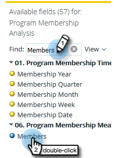

# Erstellen eines Berichts zur Analyse der Programmmitgliedschaft, der Leads auflistet {#build-a-program-membership-analysis-report-that-lists-leads}

Führen Sie diese Schritte aus, um einen Bericht zur Programmteilnahmeanalyse zu erstellen, in dem alle Namen der Programmmitglieder angezeigt werden.

>[!AVAILABILITY]
>
>Nicht alle Marketo Engage-Benutzer haben diese Funktion erworben. Weitere Informationen erhalten Sie vom Adobe Account Team (Ihrem Kundenbetreuer).

1. Launch Umsatz Explorer.

   

1. Klicken Sie auf **Neu erstellen** und dann auf **Bericht**.

   

1. Wählen Sie **Analyse der Programmmitgliedschaft** und klicken Sie auf **OK**.

   

1. Doppelklicken Sie auf den gelben Punkt Programmname.

   

1. Doppelklicken Sie auf den blauen Punkt Mitglieder.

   

1. Doppelklicken Sie auf den blauen Punkt Erfolg (Gesamtsumme).

   

Sehen Sie, wie einfach das war?

Sie können schnell ein Lead-Attribut wie _Vollständiger Name_ hinzufügen, um zu sehen, wer die Mitglieder sind.

>[!TIP]
>
>Es gibt viele Lead-/Firmenattribute, aus denen Sie auswählen können. Schau sie an!

1. Doppelklicken Sie auf den gelben Punkt **Vollständiger Name**.

   

Da hast du es!

