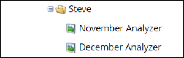

# Klonen eines Programm-Analyzers {#clone-a-program-analyzer}

Nachdem Sie einen Analyzer gespeichert haben, können Sie ihn einfach klonen, um einen neuen zu erstellen. Gehen Sie dann in und bearbeiten Sie die neue , falls Änderungen erforderlich sind.

1. Klicken Sie auf **[!UICONTROL Kachel]** Analytics“.

   

1. Klicken Sie auf **[!UICONTROL Kachel]** Programm-Analyzer“.

   

1. Öffnen Sie das Dropdown-Menü Analyzer-Aktionen , während der gespeicherte Analyzer geöffnet ist, und wählen Sie **[!UICONTROL Analyzer klonen]**.

   

1. Wählen Sie in den Dropdown-Listen **[!UICONTROL Klonen in]** und **[!UICONTROL Ordner]** den Speicherort für das geklonte Analyseprogramm aus.

   

1. Benennen Sie den geklonten Analyzer und klicken Sie auf **[!UICONTROL Klonen]**.

   

1. Nun, Sie haben zwei identische Analyzer mit unterschiedlichen Namen. Öffnen Sie den Klon, um alle erforderlichen Änderungen vorzunehmen.

   

   >[!MORELIKETHIS]
   >
   >[Erstellen eines [!UICONTROL Programm-Analyzers]](/help/marketo/product-docs/reporting/revenue-cycle-analytics/program-analytics/create-a-program-analyzer.md)
