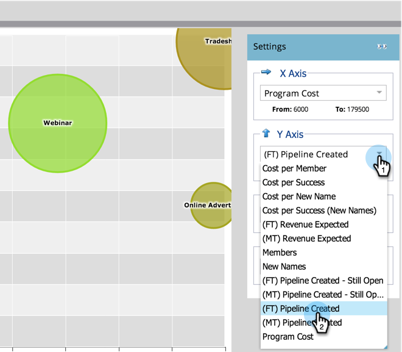

# Vergleich der Kanaleffektivität mit dem [!UICONTROL Programm-Analyzer] {#compare-channel-effectiveness-with-the-program-analyzer}

Verwenden Sie den [!UICONTROL Programm]Analyzer, um Kanalkosten, Mitgliederakquise, Pipeline, Umsatz und mehr zu vergleichen und Ihre wichtigsten und am wenigsten effektiven Kanäle zu ermitteln.

>[!PREREQUISITES]
>
>[Erstellen eines [!UICONTROL Programm-Analyzers]](/help/marketo/product-docs/reporting/revenue-cycle-analytics/program-analytics/create-a-program-analyzer.md)

1. Klicken Sie auf **[!UICONTROL Analytics]** in **My Marketo**.

   

1. Wählen Sie Ihren Programm-Analyzer aus.

   

1. Ändern Sie die Ansicht in **[!UICONTROL Nach Kanal]**.

   

1. Verwenden Sie die **[!UICONTROL X-Achse]** Dropdown-Liste, um eine Metrik für die horizontale Achse auszuwählen. Beginnen wir mit &quot;**[!UICONTROL &quot;]**.

   

1. Verwenden Sie die **[!UICONTROL Y-Achse]**, um eine Metrik für die vertikale Achse auszuwählen. Hier wird die **[!UICONTROL (FT)-Pipeline erstellt]**.

   

   >[!NOTE]
   >
   >Viele der Metriken, die Sie im Programm-Analyzer auswählen können, sind für Berechnungen mit Erstkontakt (FT) und Multi-Touch (MT) verfügbar. Es ist wichtig, den [Unterschied zwischen FT- und MT-Attribution“ zu ](/help/marketo/product-docs/reporting/revenue-cycle-analytics/revenue-tools/attribution/understanding-attribution.md).

1. Verwenden Sie die **[!UICONTROL Y-Achse]** Dropdown-Liste, um **[!UICONTROL (MT) Pipeline Erstellt auszuwählen]**.

   

   In dieser Multi-Touch-Attributionsansicht sehen wir, dass der Webinar-Kanal mehr Einfluss auf die erstellte Pipeline hat und weniger kostet als die Kanäle Messe und Online-Advertising.

   Fügen wir nun zwei weitere Dimensionen hinzu!

1. Verwenden Sie die **[!UICONTROL Bubble Size]**, um eine zusätzliche Kennzahl auszuwählen, z. B **[!UICONTROL „Neue Namen]**.

   

1. Sehen Sie, wie sich das Diagramm ändert.

   

   Wir sehen, dass der Webinar-Kanal schrumpft, wie durch &quot;**[!UICONTROL Namen“]**. Wir können zu dem Schluss kommen, dass es zwar viele Mitglieder hat, aber weniger effektiv ist, neue Leads zu generieren als der Handelsmesse-Kanal.

1. Verwenden Sie abschließend die Dropdown-Liste Farbe , um die vierte Dimension hinzuzufügen. Wählen Sie **[!UICONTROL (FT) Umsatz Gewonnen]**.

   

1. Beobachten Sie die Farbänderung in Ihrem Diagramm.

   

   Aus den Farben erfahren wir, dass der Messekanal, die grünste Blase, den höchsten erzielten Umsatz beeinflusst hat, gemessen an der Attribution auf Erstkontakt.

1. Wenn wir die Farbmetrik nun in **[!UICONTROL (MT) Umsatz gewonnen]** ändern, sehen wir, dass der Online Advertising-Kanal, jetzt der grünste, im _mehr Umsatz beeinflusste_ Webinar- und Messekanäle.

   

In unserem Beispiel sehen wir, dass der Kanal der Fachmesse sowohl der teuerste (am weitesten rechts) als auch der erfolgreichste (am höchsten auf der Y-Achse) ist, wenn es um die Messung der Pipeline geht, die durch Erstkontakt erstellt wurde. Betrachten wir nun die Pipeline jedes Kanals, die erstellt wurde, wie durch Multi-Touch-Attribution gemessen.

>[!TIP]
>
>Die Beispiele in diesen Schritten messen die Effektivität basierend auf der erstellten Pipeline. Verwenden Sie die [!UICONTROL Y-Achse] Dropdown-Liste, um andere Möglichkeiten zur Messung der Kanaleffektivität auszuwählen, z. B[!UICONTROL  „Neue ]&quot;, [!UICONTROL Mitglieder], [!UICONTROL Kosten pro Erfolg] usw.

>[!MORELIKETHIS]
>
>* [Erkunden von Programm- und Kanaldetails mit dem [!UICONTROL Program Analyzer]](/help/marketo/product-docs/reporting/revenue-cycle-analytics/program-analytics/explore-program-and-channel-details-with-the-program-analyzer.md)
>* [Vergleichen der Programmeffektivität mit dem [!UICONTROL Programm-Analyzer]](/help/marketo/product-docs/reporting/revenue-cycle-analytics/program-analytics/compare-program-effectiveness-with-the-program-analyzer.md)
