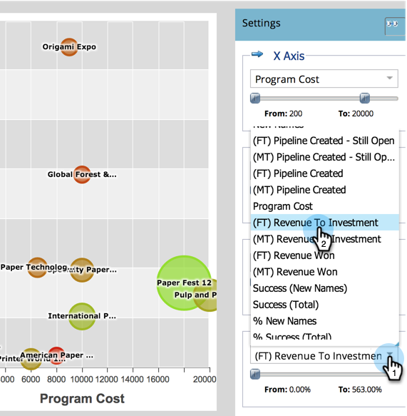

# Vergleichen der Programmwirksamkeit mit dem Programm-Analyzer {#compare-program-effectiveness-with-the-program-analyzer}

Verwenden Sie den Programm-Analyzer, um Ihre effektivsten und effizientesten Programme zu identifizieren, indem Sie Programmkosten, Mitgliederakquise, Pipeline und Umsatz vergleichen.

>[!PREREQUISITES]
>
>[Programm-Analyzer erstellen](/help/marketo/product-docs/reporting/revenue-cycle-analytics/program-analytics/create-a-program-analyzer.md)

1. Klicks **Analytics**.

   

1. Wählen Sie Ihren Programm-Analyzer aus.

   

1. Ändern Sie die Ansicht in Programm nach .

   

1. Verwenden Sie den Kanalfilter , um die Ansicht auf nur einen oder zwei Kanäle zu reduzieren. Zunächst werden wir uns Programme im Kanal Tradeshow ansehen.

   

   >[!TIP]
   >
   >Eine schnelle Möglichkeit, Programme nach nur einem Kanal zu filtern, besteht darin, **Ansicht** > **Nach Kanal**, klicken Sie auf die Blase für diesen Kanal und dann im Popup-Dialogfeld auf den Kanalnamen.

1. Verwenden Sie die Dropdownliste X-Achse , um eine Metrik für die horizontale Achse auszuwählen. Wir beginnen mit den Programmkosten.

   

1. Verwenden Sie die Dropdownliste Y-Achse , um eine Metrik für die vertikale Achse auszuwählen. Wählen wir &quot;Neue Namen&quot;, um Programme zu finden, die gut darin sind, neue Leads zu erfassen.

   

1. Schalten Sie die Regler ein, um hineinzuzoomen.

   

   >[!TIP]
   >
   >Sie können auch versuchen, Ihre Ansicht zu verbessern, indem Sie von einer linearen in eine logarithmische Skala wechseln oder umgekehrt. Verwenden Sie die **Skalieren** Menü oben.

1. Sehen Sie sich das resultierende Diagramm an.

   

   In unserem Beispiel erfahren wir, dass die Origami Expo bei der Erfassung neuer Namen viel besser ist als alle anderen Programme in diesem Kanal, und zwar zu einem mittleren Preis. Aber das ist nicht die ganze Geschichte. Wir werden zwei weitere Metriken hinzufügen, um ein tieferes Verständnis zu erhalten.

1. Verwenden Sie das Dropdown-Menü &quot;Blasengröße&quot;, um eine Metrik auszuwählen, die mit der Größe der Blasen verglichen werden soll. Wir wählen (FT) Umsatz gewinnt für unser Beispiel.

   

   >[!NOTE]
   >
   >Viele der Metriken, die Sie im Programm-Analyzer auswählen können, stehen bei Erstkontakt- (FT-) und Multi-Touch-(MT-)Berechnungen zur Verfügung. Es ist wichtig, die [Differenz zwischen FT- und MT-Attribution](/help/marketo/product-docs/reporting/revenue-cycle-analytics/revenue-tools/attribution/understanding-attribution.md).

1. Sehen Sie zu, wie sich die Blasen in Ihrem Diagramm verändern.

   

   Durch Hinzufügen von **(FT) Umsatz gewinnt** Wir sehen schnell, dass die Origami Expo zwar viele neue Namen erhielt, aber vergleichsweise wenig Umsatz erzielt hat. Außerdem sehen wir, dass das Programm &quot;Paper Fest 12&quot; weniger, aber bessere Namen erhält, da es mehr Einnahmen beeinflusst (größere Blase).

1. Verwenden Sie das Dropdown-Menü Farbe , um eine vierte Metrik hinzuzufügen. Wir werden uns den Umsatz (FT) für Investitionen ansehen.

   

1. Sehen Sie sich die Farbänderungen in Ihrem Diagramm an.

   

Wir sehen, dass das Programm Paper Fest 12 nicht nur Einfluss auf mehr Umsatz (größere Blase) hat, sondern trotz seiner relativ hohen Programmkosten (auf der rechten Seite) die beste Rendite für Investitionen (grünste Blase) aller Programme im Kanal Tradeshow hat.

>[!TIP]
>
>Sie können die Programme in einem Kanal schnell mit denen in einem anderen vergleichen. Verwenden Sie einfach die **Kanalfilter** oben im Fenster, um weitere Kanäle hinzuzufügen.

>[!MORELIKETHIS]
>
>* [Kennenlernen von Programm- und Kanaldetails mit dem Programm-Analyzer](/help/marketo/product-docs/reporting/revenue-cycle-analytics/program-analytics/explore-program-and-channel-details-with-the-program-analyzer.md)
>* [Kanaleffektivität mit dem Programm-Analyzer vergleichen](/help/marketo/product-docs/reporting/revenue-cycle-analytics/program-analytics/compare-channel-effectiveness-with-the-program-analyzer.md)
