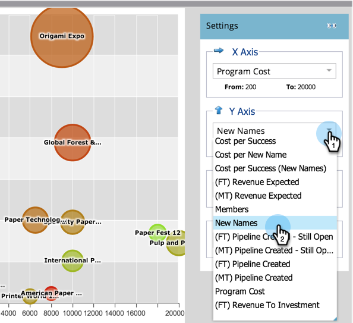
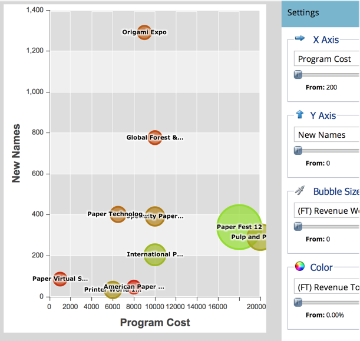

# Programm-Effektivität mit dem Programm-Analyzer vergleichen {#compare-program-effectiveness-with-the-program-analyzer}

Verwenden Sie den Programm Analyzer, um Ihre am effektivsten und effektivsten Programm zu identifizieren, indem Sie die Kosten für Programm, Mitgliederakquise, Pipeline und Umsatz vergleichen.

>[!PREREQUISITES]
>
>* [Programm-Analyzer erstellen](create-a-program-analyzer.md)

1. Klicken Sie auf Analytics.

   

1. Wählen Sie Ihren Programm Analyzer.

   

1. Ändern Sie die Ansicht in &quot;Nach Programm&quot;.

   

1. Verwenden Sie den Kanal-Filter, um die Ansicht auf ein oder zwei Kanal zu reduzieren. Vorerst werden wir uns die Programme im Kanal der Messe ansehen.

   

   >[!TIP]
   >
   >Eine schnelle Möglichkeit, Programm auf nur einen Kanal zu filtern, besteht darin, **Ansicht > Nach Kanal** auszuwählen, auf die Blase für diesen Kanal zu klicken und dann im Popup-Dialogfeld auf den Namen des Kanals zu klicken.

1. Verwenden Sie die Dropdownliste &quot;X-Achse&quot;, um eine Metrik für die horizontale Achse auszuwählen. Wir werden mit Programm-Kosten Beginn machen.

   

1. Verwenden Sie die Dropdownliste &quot;Y-Achse&quot;, um eine Metrik für die vertikale Achse auszuwählen. Wählen wir &quot;Neue Namen&quot;, um Programm zu finden, die gut darin sind, neue Interessenten zu erfassen.

   

1. Schalten Sie die Schieberegler zum Einzoomen ein.

   

   >[!TIP]
   >
   >Sie können auch versuchen, Ihre Ansicht zu verbessern, indem Sie von einer linearen zu einer logarithmischen Skala wechseln oder umgekehrt. Verwenden Sie das Menü &quot; **Skalieren** &quot;oben.

1. Machen Sie sich mit dem resultierenden Diagramm vertraut.

   

   In unserem Beispiel erfahren wir, dass die Origami-Expo viel besser ist als alle anderen Programme in diesem Kanal, wenn es darum geht, neue Namen zu erfassen, und das zu einem mittleren Preis. Aber das ist nicht die ganze Geschichte. Wir fügen zwei weitere Metriken hinzu, um ein tieferes Verständnis zu erhalten.

1. Verwenden Sie das Dropdownmenü Blasengröße, um eine Metrik auszuwählen, die mit der Größe der Blasen verglichen werden soll. Wir wählen (FT) Umsatz Won für unser Beispiel.

   

   >[!NOTE]
   >
   >Viele der Metriken, die Sie im Programm-Analyzer auswählen können, stehen mit First Touch- (FT) und Multi-Touch-(MT-)Berechnungen zur Verfügung. Es ist wichtig, den [Unterschied zwischen FT- und MT-Zuordnung](/help/marketo/product-docs/reporting/revenue-cycle-analytics/revenue-tools/attribution/understanding-attribution.md)zu verstehen.

1. Beobachten Sie, wie sich die Größe der Blasen in Ihrem Diagramm ändert.

   

   Durch Hinzufügen von **(FT) Umsatz Won**, sehen wir schnell, dass die Origami Expo viele neue Namen erworben hat, aber es führt zu vergleichsweise wenig Umsatz. Außerdem sehen wir, dass das Programm Paper Fest 12 weniger, aber bessere Namen erhält, da es mehr Umsatz erzielt (größere Blase).

1. Verwenden Sie die Dropdownliste Farbe, um eine vierte Metrik hinzuzufügen. Wir werden uns (FT) Umsatz aus Investitionen ansehen.

   

1. Beobachten Sie, wie sich die Farben in Ihrem Diagramm ändern.

   

Wir sehen, dass das Paper Fest 12-Programm nicht nur mehr Umsatz (größere Blase) beeinflusst, sondern trotz seiner relativ hohen Kosten für Programme (ganz rechts), es hat die beste Rendite (grünste Blase) aller Programme im Tradeshow-Kanal.

>[!TIP]
>
>Sie können die Programm in einem Kanal schnell mit denen in einem anderen vergleichen. Verwenden Sie einfach den **Kanal-Filter** oben im Fenster, um weitere Kanal hinzuzufügen.

>[!NOTE]
>
>**Verwandte Artikel**
>
>* [Programm- und Kanal-Details mit dem Programm Analyzer](explore-program-and-channel-details-with-the-program-analyzer.md)
>* [Kanal-Effektivität mit dem Programm-Analyzer vergleichen](compare-channel-effectiveness-with-the-program-analyzer.md)

>[!NOTE]
>
>Weitere Informationen zu erweiterten Analysen finden Sie im [Umsatz-Cycle Explorer](http://docs.marketo.com/display/docs/revenue+cycle+analytics).
