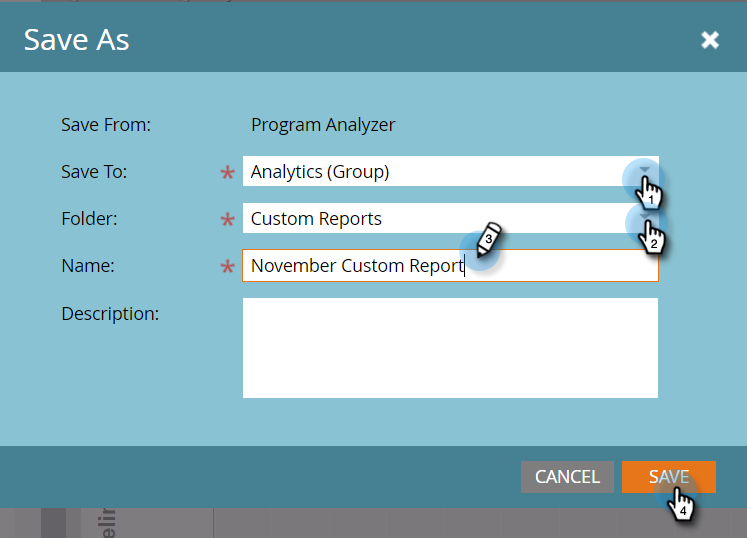

# Erstellen eines [!UICONTROL Programm-Analyzers] {#create-a-program-analyzer}

Entdecken Sie, welche Programme und Kanäle Ihnen den größten Nutzen aus Ihrem Marketing-Geld bringen. Verwenden Sie den Programm-Analyzer, um alle Kosten und Renditen im Detail zu prüfen und zu vergleichen, nach Programm oder Kanal.

>[!NOTE]
>
>Um gute Daten von einem Programm-Analyzer zu erhalten, stellen Sie sicher, dass Ihre CRM-Kontakte Rollen in den Opportunities haben und dass Ihre Marketo-Programme vollständig eingerichtet sind, wobei [Periodenkosten](/help/marketo/product-docs/reporting/revenue-cycle-analytics/revenue-tools/define-period-costs.md), Programmstatus und Erfolg definiert sind.

>[!TIP]
>
>Damit Programme ohne Kosten im Programm-Analyzer angezeigt werden, setzen [die Periodenkosten](/help/marketo/product-docs/reporting/revenue-cycle-analytics/revenue-tools/define-period-costs.md) auf $0.

1. Klicken Sie auf **[!UICONTROL Kachel]** Analytics“.

   

1. Klicken Sie auf **[!UICONTROL Kachel]** Programm-Analyzer“.

   

1. Der Standard-Programmanalysator wird angezeigt. Nehmen Sie die gewünschten Änderungen vor.

   

1. Klicken Sie auf **[!UICONTROL Setup]**, um Filter hinzuzufügen und anzupassen.

   

1. Um beispielsweise den Filter [!UICONTROL Periodenkosten] anzupassen, doppelklicken Sie darauf.

   

1. Wählen Sie den zu analysierenden Zeitraum aus und klicken Sie auf **[!UICONTROL Anwenden]**.

   

   >[!TIP]
   >
   >Um einen bestimmten Bereich auszuwählen, wählen Sie **[!UICONTROL Benutzerdefiniert]** und verwenden Sie die Felder **[!UICONTROL Von]** und **[!UICONTROL Bis]**.

1. Wenn Sie den neuen benutzerdefinierten Analyzer speichern möchten, wählen Sie in der Dropdown-Liste **[!UICONTROL Analyzer-Aktionen]** die Option **[!UICONTROL Speichern unter]**.

   

1. Wählen Sie den Speicherort, an dem Sie den benutzerdefinierten Analyzer speichern möchten, mithilfe der [!UICONTROL Speichern in] und [!UICONTROL Ordner] aus. Benennen Sie den neuen benutzerdefinierten Analyzer. Eine Beschreibung ist optional. Klicken Sie auf **[!UICONTROL Speichern]**.

   

1. Du hast es geschafft! Klicken Sie auf die Hauptregisterkarte, um Ihre Programme und Kanäle zu erkunden und zu vergleichen.

>[!NOTE]
>
>Viele der Metriken, die Sie im Programm-Analyzer auswählen können, sind für Berechnungen mit Erstkontakt (FT) und Multi-Touch (MT) verfügbar. Es ist wichtig, den [Unterschied zwischen FT- und MT-Attribution“ zu ](/help/marketo/product-docs/reporting/revenue-cycle-analytics/revenue-tools/attribution/understanding-attribution.md).

>[!MORELIKETHIS]
>
>* [Vergleichen der Kanaleffektivität mit dem [!UICONTROL Programm-Analyzer]](/help/marketo/product-docs/reporting/revenue-cycle-analytics/program-analytics/compare-channel-effectiveness-with-the-program-analyzer.md)
>* [Vergleichen der Programmeffektivität mit dem [!UICONTROL Programm-Analyzer]](/help/marketo/product-docs/reporting/revenue-cycle-analytics/program-analytics/compare-program-effectiveness-with-the-program-analyzer.md)
>* [Erkunden von Programm- und Kanaldetails mit dem [!UICONTROL Program Analyzer]](/help/marketo/product-docs/reporting/revenue-cycle-analytics/program-analytics/explore-program-and-channel-details-with-the-program-analyzer.md)
>* [Klonen eines [!UICONTROL Programm-Analyzers]](/help/marketo/product-docs/reporting/revenue-cycle-analytics/program-analytics/clone-a-program-analyzer.md)
