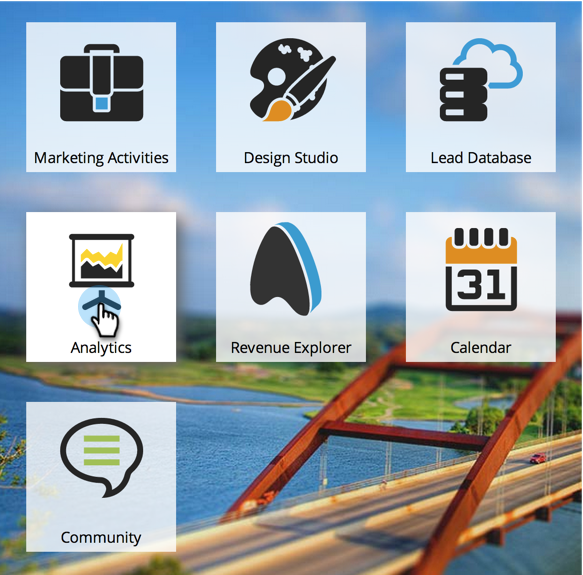
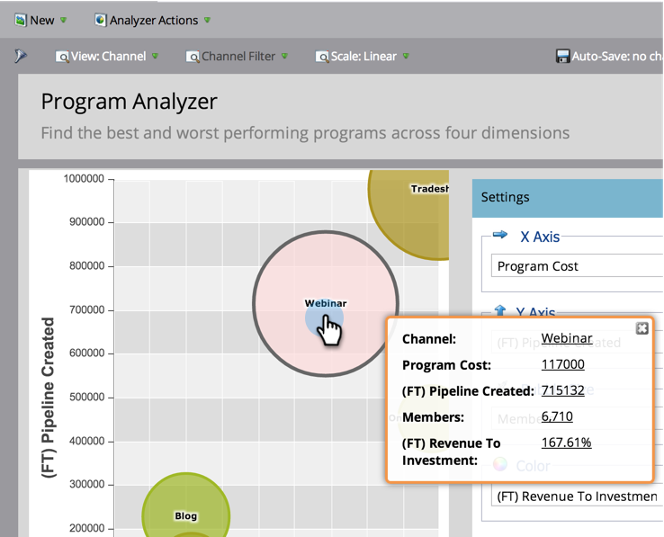
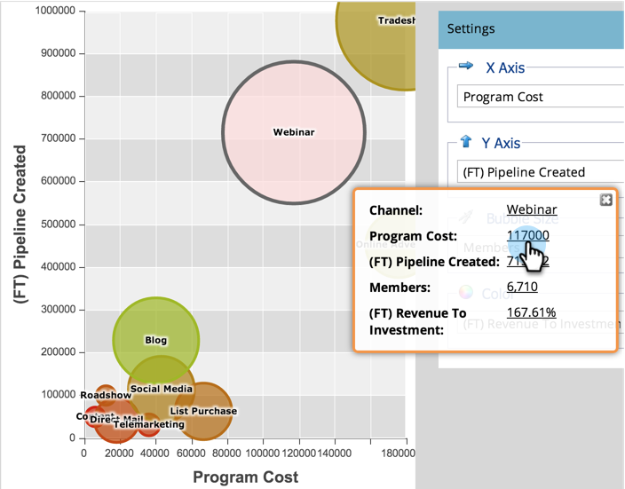

# Erkunden von Programm- und Kanaldetails mit dem [!UICONTROL Programm-Analyzer] {#explore-program-channel-details-with-the-program-analyzer}

Detaillierte Programm- und Kanalstatistiken finden Sie im [!UICONTROL Programm-Analyzer]. Sie können sie auch im Umsatzzyklus-Explorer öffnen.

>[!PREREQUISITES]
>
>[Erstellen eines [!UICONTROL Programm-Analyzers]](/help/marketo/product-docs/reporting/revenue-cycle-analytics/program-analytics/create-a-program-analyzer.md)

>[!AVAILABILITY]
>
>Nicht alle Marketo-Editionen enthalten diese Funktion. Weitere Informationen erhalten Sie von Ihrem Account Manager.

1. Klicken Sie auf **[!UICONTROL Analytics]**.

   

1. Wählen Sie Ihren Programm-Analyzer aus.

   

1. Um die spezifischen Statistiken für einen Kanal oder ein Programm anzuzeigen (je nach ausgewählter **[!UICONTROL Ansicht]** klicken Sie auf die entsprechende Blase.

   

   >[!NOTE]
   >
   >Viele der Metriken, die Sie im Programm-Analyzer auswählen können, sind für Berechnungen mit Erstkontakt (FT) und Multi-Touch (MT) verfügbar. Es ist wichtig, den [Unterschied zwischen FT- und MT-Attribution“ zu ](/help/marketo/product-docs/reporting/revenue-cycle-analytics/revenue-tools/attribution/understanding-attribution.md).

1. Um alle Programme in einem Kanal zu vergleichen, klicken Sie auf den Kanalnamen im Popup-Dialogfeld.

   

1. Jetzt können Sie die einzelnen Programme innerhalb dieses Kanals vergleichen!

   

   >[!NOTE]
   >
   >Wenn Sie auf einen einzelnen Kanal klicken, wird die Ansicht zu Nach Programm gefiltert und nur auf diesen Kanal geändert. Um zu allen Kanälen zurückzukehren, wählen Sie **[!UICONTROL Ansicht]** > **[!UICONTROL Nach Kanal]**.

1. Um den Umsatzzyklus-Explorer zu öffnen und eine Statistik noch tiefer zu untersuchen, klicken Sie auf diese Zahl im Popup-Dialogfeld.

   
