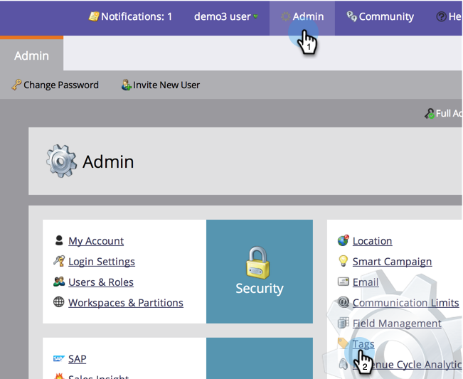
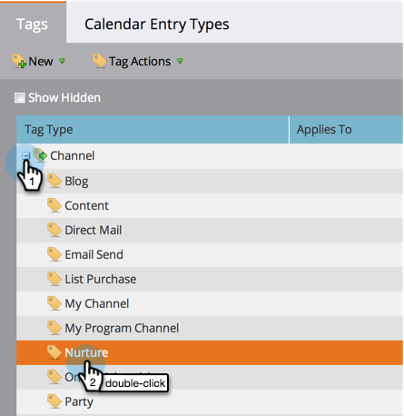

# Verfügbarmachung eines Programms ohne Kostenzeitraum in Revenue Explorer und Analyzer {#make-a-program-without-a-period-cost-available-in-revenue-explorer-and-analyzers}

Mit Kosten für den Programmzeitraum können Sie festlegen, „wie viel Geld“ und „wann“ für ein Programm ausgegeben werden soll. Dies wird im Umsatzzyklus-Explorer und in [Analyzer](/help/marketo/product-docs/reporting/revenue-cycle-analytics/opportunity-influence-analyzer/tell-the-marketing-story-with-an-opportunity-influence-analyzer.md) angezeigt.

>[!NOTE]
>
>**Admin-Berechtigungen erforderlich**

Einige Programme müssen möglicherweise einbezogen werden, auch wenn sie keine Periodenkosten haben. Obwohl Sie für den Kostenzeitraum 0 eingeben können, haben wir die Einbeziehung dieser Programme vereinfacht.

>[!NOTE]
>
>Der Programm-Analyzer erfasst den Programmerfolg nach Kostenzeitraum. Wenn keine Periodenkosten verfügbar sind, wird der Programmerfolg unabhängig vom Analyseverhalten des Programms nicht angezeigt. Wenn das Analytics-Verhalten eingerichtet ist, werden Daten für Opportunity-Metriken angezeigt (Pipeline-Opportunities, gewonnener Umsatz usw.).

1. Klicken Sie [!UICONTROL &#x200B; Abschnitt &#x200B;]Admin“ auf **[!UICONTROL Tags]**.

   

1. Erweitern Sie Ihre Kanäle und doppelklicken Sie auf den Kanal Ihrer Wahl.

   >[!NOTE]
   >
   >Alle Programme, die diesen Kanal verwenden, werden unabhängig von den Periodenkosten für Revenue Explorer und Analyzer verfügbar. Diese Änderung wird am folgenden Tag wirksam.

   

1. Ändern Sie [!UICONTROL Analytics Behavior] in **Inclusive** und klicken Sie auf **[!UICONTROL Speichern]**.

   

>[!TIP]
>
>Haben Sie die Option „Operativ“ bemerkt? Dies bewirkt das Gegenteil. Sie schließt diese Programme unabhängig von den Periodenkosten aus.

Gute Arbeit! Jetzt werden alle Programme, die den geänderten Kanal verwenden, in den Umsatz-Explorer und -Analyzer einbezogen, ohne dass ein Kostenzeitraum erforderlich ist.

>[!MORELIKETHIS]
>
>[Überschreiben des Analytics-Verhaltens auf Programmebene](/help/marketo/product-docs/reporting/revenue-cycle-analytics/program-analytics/override-analytics-behavior-at-the-program-level.md)
