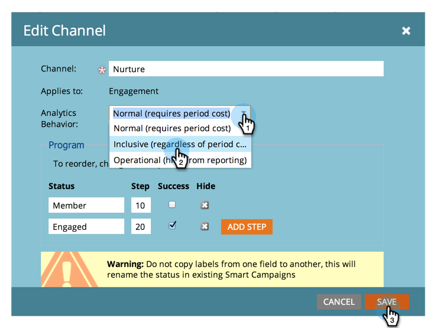

# Programme ohne Zeitkosten in Umsatz Explorer und Analyzers {#make-a-program-without-a-period-cost-available-in-revenue-explorer-and-analyzers} verfügbar machen

Die Programm-Period-Kosten ermöglichen es Ihnen, &quot;Wie viel Geld&quot;und &quot;Wann&quot;für ein Programm zu definieren. Dies wird in [Umsatz-Zyklus-Explorer](http://docs.marketo.com/display/docs/revenue+cycle+analytics) und [Analyzer](../../../../product-docs/reporting/revenue-cycle-analytics/opportunity-influence-analyzer/tell-the-marketing-story-with-an-opportunity-influence-analyzer.md) angezeigt.

>[!NOTE]
>
>**Administratorberechtigungen erforderlich**

Einige Programm müssen ggf. einbezogen werden, auch wenn sie keine Zeitraumkosten haben. Obwohl Sie für die Zeitraumkosten den Wert 0 eingeben können, wurde die Einbeziehung dieser Programm erleichtert.

>[!NOTE]
>
>Der Programm-Analyzer erfasst Programm-Erfolg nach Periodenkosten. Wenn keine Periodenkosten verfügbar sind, wird der Erfolg des Programms unabhängig vom Analyseverhalten des Programms nicht angezeigt. Wenn das Analyseverhalten eingerichtet ist, werden Daten zu Opportunitätsmetriken (Pipeline-Möglichkeiten, Umsatz usw.) angezeigt.

1. Klicken Sie im Abschnitt Admin auf Tags.

   

1. Erweitern Sie Ihre Kanal und Dublette klicken Sie auf den Kanal Ihrer Wahl.

   >[!NOTE]
   >
   >**Erinnerung**
   >
   >Alle Programm, die diesen Kanal verwenden, stehen unabhängig von den Periodenkosten Umsatzforschern und -analysatoren zur Verfügung. Diese Änderung wird am folgenden Tag wirksam.

   

1. Ändern Sie das Analytics-Verhalten in &quot;Inclusive&quot;und klicken Sie auf &quot;Speichern&quot;.

   

>[!TIP]
>
>Haben Sie die Option &quot;Betrieb&quot;bemerkt? Das tut das Gegenteil. Diese Programm werden unabhängig von den Zeitkosten ausgeschlossen.

Gute Arbeit! Jetzt werden alle Programm, die den modifizierten Kanal verwenden, ohne Zeitraumkosten in Umsatz- und Analyzer-Programme eingeschlossen.

>[!MORELIKETHIS]
>
>* [Analytics-Verhalten auf Programm-Ebene außer Kraft setzen](override-analytics-behavior-at-the-program-level.md)

>

