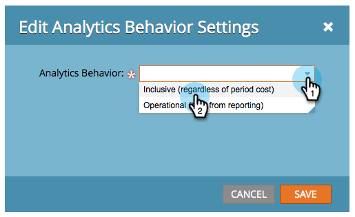
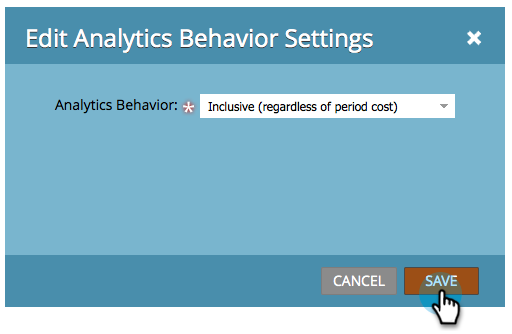

# Überschreiben des Analyseverhaltens auf Programmebene {#override-analytics-behavior-at-the-program-level}

Sie können das [Analytics-Verhalten auf der Admin-Ebene für Kanäle &#x200B;](/help/marketo/product-docs/reporting/revenue-cycle-analytics/program-analytics/make-a-program-without-a-period-cost-available-in-revenue-explorer-and-analyzers.md), es kann aber auch auf Programmebene überschrieben werden. So geht&#39;s:

1. Navigieren Sie zum Bereich **[!UICONTROL Marketing-Aktivitäten]**.

   

1. Suchen und wählen Sie Ihr Programm aus.

   

1. Ziehen Sie auf **[!UICONTROL Registerkarte]** Setup“ [!UICONTROL Analytics Behavior] auf die Arbeitsfläche.

   

1. Wählen Sie das [!UICONTROL Analytics-Verhalten] aus, das Sie möchten.

   >[!NOTE]
   >
   >**Definition**
   >
   >* **Einschließlich** - Mit dieser Option wird sichergestellt, dass das Programm für das Reporting im Umsatz-Explorer und in Analyzern verfügbar ist, unabhängig davon, ob Sie einen Kostenzeitraum einbezogen haben oder nicht.
   >* **Operativ** - Diese Option führt dazu, dass das Programm weder im Umsatz-Explorer noch in Analyzern angezeigt wird.

   >[!NOTE]
   >
   >Das Standardverhalten (wenn diese Einstellung nicht angewendet wird) besteht darin, dass das Programm in Analytics eingeschlossen wird **NUR bei Kosten für mindestens einen Zeitraum** auch nur für einen mit null Dollar.

   

1. Klicken Sie auf **[!UICONTROL Speichern]**.

   

Gut gemacht! Jetzt wissen Sie, wie Sie das Analytics-Verhalten auf Programmebene überschreiben.

>[!NOTE]
>
>Die Änderungen treten am nächsten Tag in Kraft und werden entweder bereitgestellt oder aus dem Revenue Explorer und Analyzer abgerufen.
