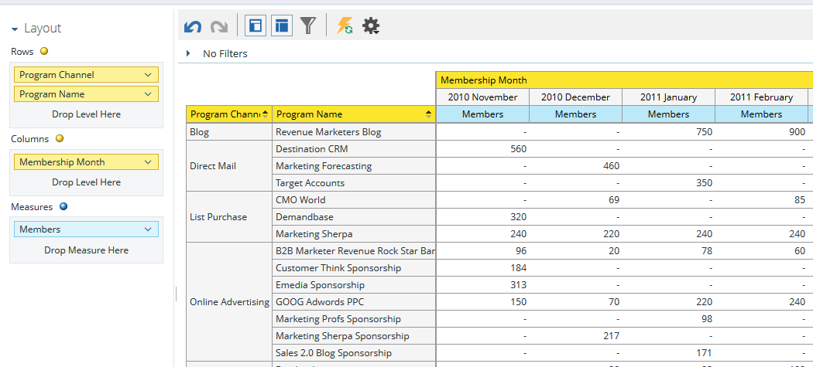
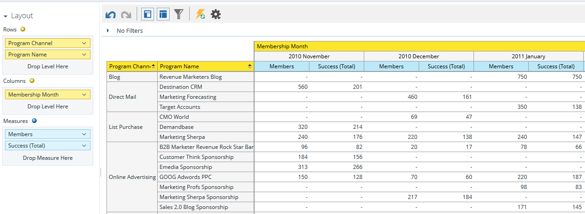

# Grundlegendes zum Bereich für die Programmzugehörigkeits-Analyse {#understanding-the-program-membership-analysis-area}

Im Bereich Analyse der Programmmitgliedschaft können Sie die Effektivität einzelner Programme analysieren oder zusammengefasste Ergebnisse nach Kanal für einen bestimmten Zeitraum anzeigen.

## Beispiele für geschäftliche Fragen {#example-business-questions}

Wie viele Personen nahmen an einem Programm pro Kanal in einem bestimmten Monat teil?

Wie viele Personen haben die Erfolgskriterien eines bestimmten Programms erreicht?

Wie viele neue Namen hat jedes Programm/jeder Kanal pro Monat generiert?

## Dimensionen und Maßnahmen zur Analyse der Programmmitgliedschaft {#program-membership-analysis-dimensions-and-measures}

>[!NOTE]
>
>Gelbe Punkte sind Dimensionen und blaue Punkte sind Messungen.

### Mitgliedschaft {#membership}

| Maßnahme | Beschreibung |
|---|---|
| Anteil neuer Namen | Prozentsatz der Leads, die in einem Programm erworben wurden |
| Mitglieder | Leads in einem Programm insgesamt |
| Neue Namen | Gesamtzahl der von einem Programm erworbenen neuen Namen |

### Programmattribute {#program-attributes}

| Dimension | Beschreibung |
|---|---|
| Programmkanal | Programmkanal |
| Programmname | Programmname |

### Zeitraum für die Programmmitgliedschaft {#program-membership-timeframe}

| Dimension | Beschreibung |
|---|---|
| Year | Zeitrahmen der Programmmitgliedschaft |
| Quartal | Zeitrahmen der Programmmitgliedschaft |
| Month | Zeitrahmen der Programmmitgliedschaft |
| Woche | Zeitrahmen der Programmmitgliedschaft |
| Datum | Zeitrahmen der Programmmitgliedschaft |

### Erfolgreich {#success}

| Maßnahme | Beschreibung |
|---|---|
| Erfolg in % (Neue Namen) | Prozentsatz der Leads, die vom Programm akquiriert UND im Verlauf des Programms erfolgreich waren |
| % Erfolg (Summe) | Prozentsatz der Leads, die beim Fortschreiten eines Programms erfolgreich waren |
| Erfolg (Neue Namen) | Gesamtzahl der neuen Namen, die beim Fortschreiten eines Programms erfolgreich waren |
| Erfolg (Summe) | Gesamtzahl der Leads, die beim Fortschreiten eines Programms erfolgreich waren |
