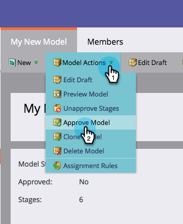

# Genehmigen/Aufheben der Genehmigung eines Umsatzmodells {#approve-unapprove-a-revenue-model}

Es kann immer nur ein genehmigtes Modell zur Verfügung stehen.

>[!CAUTION]
>
>[Einzelne Stadien müssen genehmigt werden](/help/marketo/product-docs/reporting/revenue-cycle-analytics/revenue-cycle-models/approving-stages-and-assigning-leads-to-a-revenue-model.md) und Personen müssen hinzugefügt werden, bevor Sie ein ganzes Modell genehmigen.

## Genehmigen {#approve}

1. Wechseln Sie zum Bereich **[!UICONTROL Analytics]**.

   

1. Wählen Sie ein Modell aus der Baumstruktur aus.

   

1. Wählen Sie im Menü **[!UICONTROL Modellaktionen]** die Option **[!UICONTROL Modell genehmigen]** aus.

   

1. Es wird ein Dialogfeld angezeigt, um Ihre Auswahl zu bestätigen. Klicken Sie **[!UICONTROL Genehmigen]**.

   

Ihr Modell ist jetzt live!

## Genehmigung aufheben {#unapprove}

>[!CAUTION]
>
>Wenn Sie die Genehmigung für Ihr Modell aufheben, werden alle Ihre Personen aus dem Modell entfernt und ihr Verlauf im Modell wird gelöscht!

1. Wechseln Sie zum Bereich **[!UICONTROL Analytics]**.

   

1. Wählen Sie ein Modell aus der Baumstruktur aus.

   

1. Klicken Sie auf das **[!UICONTROL Modell-Aktionen]** und wählen Sie **[!UICONTROL Modell nicht genehmigen]** aus.

   

1. Klicken Sie im [!UICONTROL Modell nicht genehmigen] angezeigten Dialogfeld auf **[!UICONTROL Genehmigung aufheben]**.

   

Herzlichen Glückwunsch! Ihr Modell ist jetzt nicht genehmigt.

>[!CAUTION]
>
>Wenn Sie die Genehmigung für ein Modell aufheben, werden alle Ihre Personen aus dem Modell entfernt und ihr Verlauf im Modell wird aus der Datenbank entfernt.
