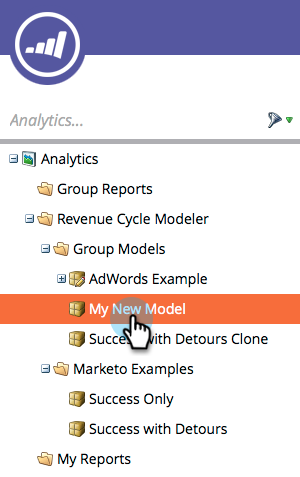

# Genehmigen/Aufheben der Genehmigung eines Umsatzmodells {#approve-unapprove-a-revenue-model}

Sie dürfen zu jedem Zeitpunkt nur ein genehmigtes Modell haben.

>[!CAUTION]
>
>[Einzelne Phasen müssen genehmigt werden](/help/marketo/product-docs/reporting/revenue-cycle-analytics/revenue-cycle-models/approving-stages-and-assigning-leads-to-a-revenue-model.md) und Personen müssen hinzugefügt werden, bevor Sie ein ganzes Modell genehmigen.

## Genehmigen {#approve}

1. Wechseln Sie zum Bereich **Analytics** .

   

1. Wählen Sie ein Modell aus dem Baum aus.

   

1. Wählen Sie im Menü **Modellaktionen** die Option **Modell genehmigen**.

   

1. Es wird ein Dialogfeld angezeigt, in dem Sie Ihre Auswahl bestätigen können. Klicken Sie auf **Genehmigen**.

   

Ihr Modell ist jetzt live!

## Genehmigung aufheben {#unapprove}

>[!CAUTION]
>
>Wenn Sie Ihr Modell nicht genehmigen, werden alle Ihre Personen aus dem Modell entfernt und ihr Verlauf im Modell wird gelöscht!

1. Wechseln Sie zum Bereich **Analytics** .

   

1. Wählen Sie ein Modell aus dem Baum aus.

   

1. Klicken Sie auf das Menü **Modellaktionen** und wählen Sie **Modell nicht genehmigen**.

   

1. Klicken Sie im angezeigten Dialogfeld auf **Modell nicht genehmigen**.

   

Herzlichen Glückwunsch! Ihr Modell ist jetzt nicht genehmigt.

>[!CAUTION]
>
>Wenn Sie ein Modell nicht genehmigen, werden alle Ihre Personen aus dem Modell entfernt und ihr Verlauf im Modell wird aus der Datenbank entfernt.
