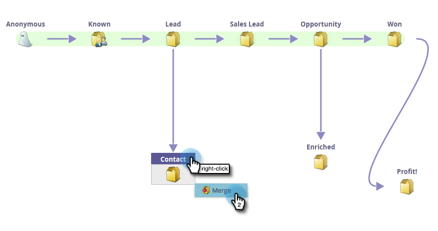
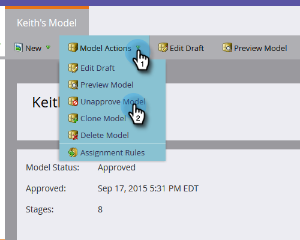
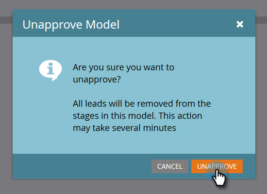

# Bearbeiten des genehmigten Modells {#editing-your-approved-model}

## Modell bearbeiten {#editing-your-model}

1. Wählen Sie das Modell aus, an dem Sie im Abschnitt &quot;Analytics&quot;Änderungen vornehmen möchten, und klicken Sie auf **Entwurf bearbeiten**.

   

1. Sie können keine Phasen löschen, wenn Sie einen Entwurf bearbeiten (nachdem das Modell genehmigt wurde). Stattdessen können Sie diese Phase mit einer anderen im Modell zusammenführen. Klicken Sie mit der rechten Maustaste auf die Phase, die Sie zusammenführen möchten, und klicken Sie auf **Zusammenführen**.

   

1. Wählen Sie die neue Bühne für Leads aus, die sich derzeit in der ausgewählten Phase befinden, oder wählen Sie **Keine** aus, um die Leads aus Ihrem Modell zu entfernen. Wenn Sie fertig sind, klicken Sie auf **Zusammenführen**.

   

1. Wenn Sie Änderungen am Modell vorgenommen haben, genehmigen Sie es erneut, indem Sie im Menü **Modellaktionen** die Option **Modellentwurf genehmigen** auswählen.

   

   >[!TIP]
   >
   >Wenn Sie Änderungen an Ihren Bühnen vornehmen, z. B. Hinzufügen oder Zusammenführen, müssen Sie die Zuweisungsregeln und -phasen entsprechend Ihren Bearbeitungen ändern.

## Nicht genehmigen des Modells {#unapproving-your-model}

>[!CAUTION]
>
>Wenn Sie die Genehmigung des Modells aufheben, werden alle Leads entfernt und ihr Verlauf im Modell wird gelöscht. Erwägen Sie, Ihr Modell zu bearbeiten, anstatt die Genehmigung aufzuheben.

1. Wählen Sie das Modell aus, dessen Genehmigung Sie aufheben möchten. Wählen Sie im Menü **Modellaktionen** die Option **Modell nicht genehmigen** aus.

   

1. Klicken Sie auf **Nicht genehmigen**.

   

>[!NOTE]
>
>Wenn Sie dieses Modell erneut genehmigen möchten, müssen Sie zuerst Leads zu den Bühnen neu zuweisen.

## Erstellen weiterer Modelle {#creating-more-models}

Sie können jeweils nur ein genehmigtes Modell haben. Wenn Sie ein Modell genehmigen möchten, aber bereits ein Modell genehmigt wurde, müssen Sie die Genehmigung für das aktuelle Modell zuerst aufheben. Versuchen Sie nach Möglichkeit, Ihr Modell zu bearbeiten, anstatt ein neues zu erstellen.

>[!MORELIKETHIS]
>
>[Neues Umsatzmodell erstellen](/help/marketo/product-docs/reporting/revenue-cycle-analytics/revenue-cycle-models/create-a-new-revenue-model.md)
